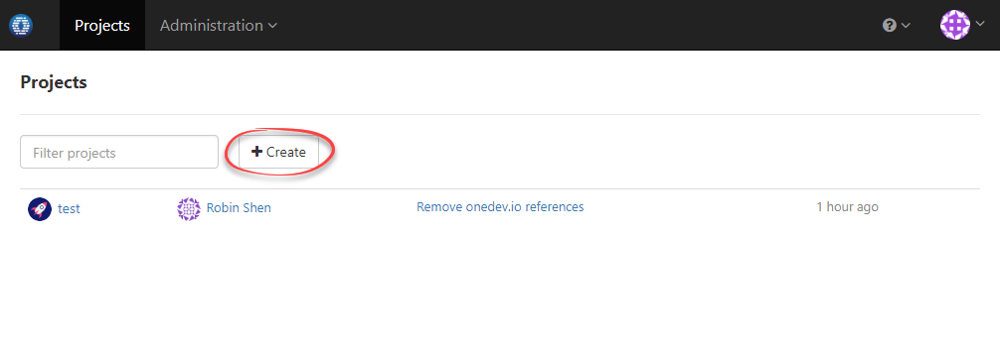

# Create New Project
--------------------

By default only site administrator can create projects. To make other users able to create projects, they need to be assigned with [project creation permission](security-management.md#permission-to-create-project). Project can be added from dashboard like below:

