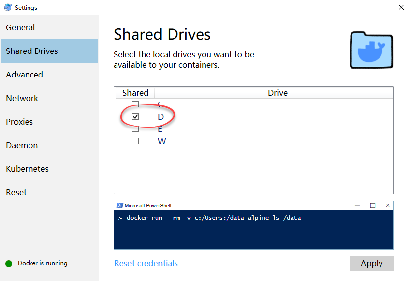

# Introduction

OneDev has built-in CI support to build projects. The build instructions are defined in _onedev-ci.xml_ in root of the project (do not worry about writing this xml, OneDev has visual editor to help you doing that). For some typical projects, it is possible that some default build instructions can be deducted automatically without existence of _onedev-ci.xml_. Hence we introduced extension point [DefaultCISpecProvider](https://github.com/theonedev/onedev/blob/master/server-core/src/main/java/io/onedev/server/extensionpoint/DefaultCISpecProvider.java) to support different kinds of projects via plugins, and want you to help writing such plugin.

# Pre-requisite

### Application framework knowledge

To write such plugin, you will need to be familiar with some application frameworks, especially its underlying build/test mechanism. For instance, Spring project in Java world normally contains a file _pom.xml_ under the project root, and it means that the project can be built/test with Apache Maven by calling _mvn clean test_. So the [maven plugin](https://github.com/theonedev/onedev/tree/master/server-plugin/server-plugin-maven) checks existence of _pom.xml_ and parses this file to help generating the default CI spec if it exists.

### Be familiar with Docker technology

Different projects may require different environments to build and test. OneDev relies on [docker](https://www.docker.com/) to solve this issue. When provide default CI spec for a particular project, you will need to decide which Docker image to use by analyzing the project files. 

# Write the plugin

1. Install Docker on your development machine. Either Windows or Linux is supported. Please note that on Windows, you will need to configure [docker for windows](https://docs.docker.com/docker-for-windows) to share the drive on which you plan to checkout OneDev source code

   
   
1. Follow [this guide](Develop-Built-In-Plugins) to prepare the plugin development environment. The follow below steps to get familiar with OneDev CI support:

  - Run OneDev from IDE
  - Switch to administration page, and add a new job executor of type _server job executor_
  - Create a new project
  - Use [Spring Initializer](https://start.spring.io/) to generate a new Java based Maven project
  - Push the project into OneDev, and make sure the pom.xml exists in project root folder
  - OneDev should be able to run the CI job automatically. Switch to commits page to check build status. If there are any errors, you may fix the error and then re-run the build
  
1. Check the [maven plugin](https://github.com/theonedev/onedev/tree/master/server-plugin/server-plugin-maven) to see how we provided default CI spec for maven projects

1. Then decide which framework you want to provide default CI spec for. Some suggested popular frameworks:

  - [Ruby on Rails](https://rubyonrails.org/)
  - [Django](https://www.djangoproject.com/)
  - [Laravel](https://laravel.com/)
  - [Meteor](https://www.meteor.com/)
  - [Express](https://expressjs.com/)
  - [Angular](https://angular.io/)
  - [React](https://reactjs.org/)
  - [Vue](https://vuejs.org/)
  - Android App?
  - [Asp.net](https://dotnet.microsoft.com/apps/aspnet)