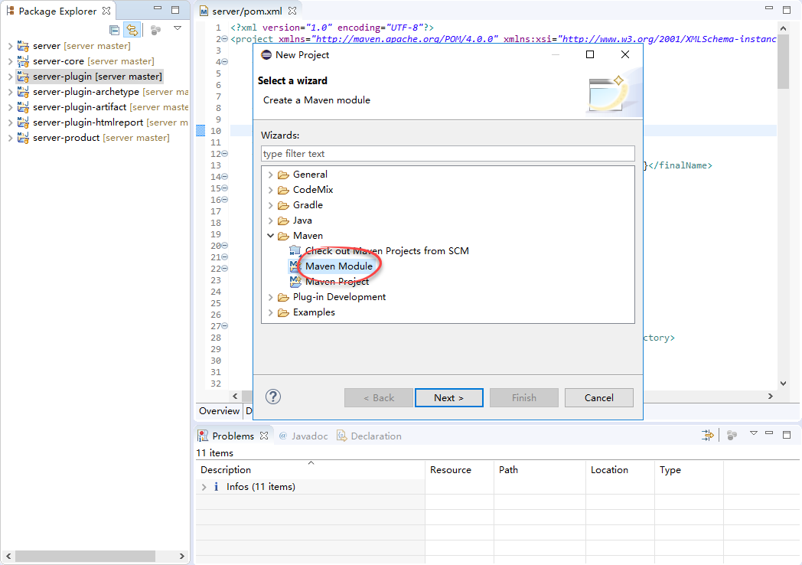

Built-in plugins ships together with OneDev, and requires OneDev source code to develop. Follow below steps to add a new built-in plugin project:

1. First follow [this guide](Set-Up-Development-Environment) to set up OneDev development environment

2. Add a new plugin project by adding a new Maven module:  
   
   
   
   
3. In next page, specify module name. The module name should follow the convention of _server-plugin-<plugin name>_. And the parent project should be specified as _server-plugin_. Also make sure **NOT** to check the _create a simple project_ option

    

    

4. Click the next button to go to next page. If this is the first time you adding a OneDev plugin, you will need to click the _configure_ button to add OneDev remote archetype catalog. The catalog url is: 
   https://artifact.pmease.com/artifactory/pmeaseRepo/archetype-catalog.xml. Apply and close the catalog adding dialog, Eclipse should list all archetypes relating to OneDev. If you added the catalog before, just input _io.onedev_ to filter the archetype

5. From OneDev archetype list page, choose the archetype **matching** your current OneDev version (Check OneDev server pom file to find current version)

   

   

6. In the next page, specify group id and version. For built-in plugin project, group id must always be _io.onedev_, and version will actually be ignored (always use current OneDev version) 

    

7. Finish adding the plugin. Eclipse will take a while to build the newly added plugin