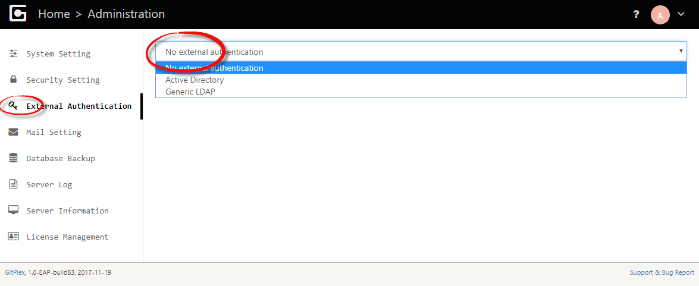

# LDAP and Active Directory Integration
-------------------------

OneDev can be configured to authenticate users via LDAP or Active Directory in [administration menu](Server-Administration-Menu) as below:

