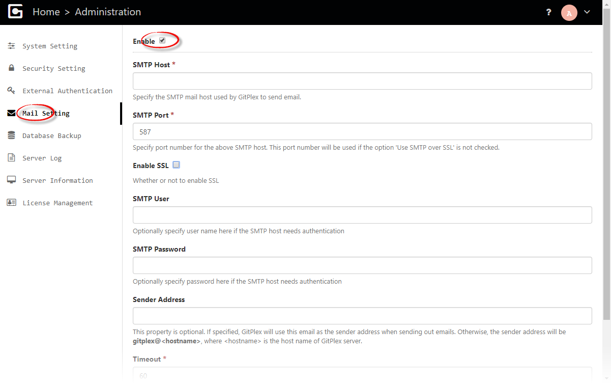

# Mail Set Up
-----------------------

OneDev sends email to relevant users when particular event happens. Mail setting can be specified as below in [administration menu](Server-Administration-Menu.md):

