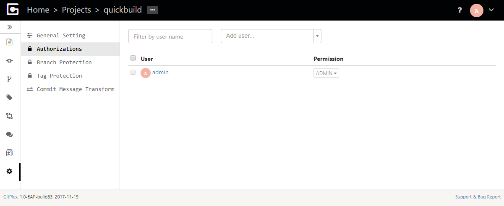
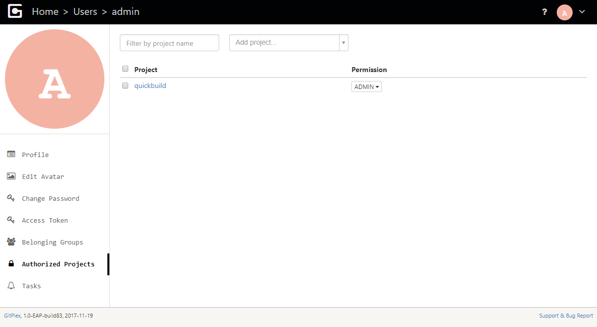
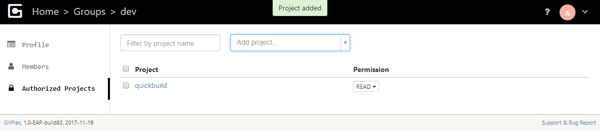

Project can be authorized in three ways:

1. Authorize from project side:

  
  
  This can only be performed by project administrators.
  
2. Authorize from user side:
  
  
  
  This can only be performed by site administrator. 
  
3. Authorize from group side:

  
   
  All users belonging to the group will get granted permissions of the group. This operation can only be performed by site administrator.
