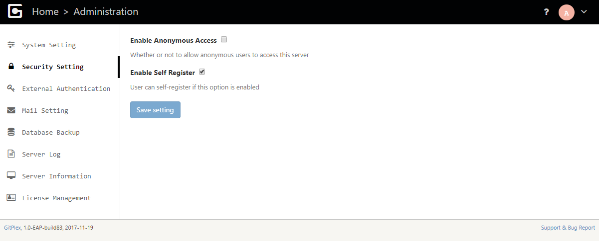
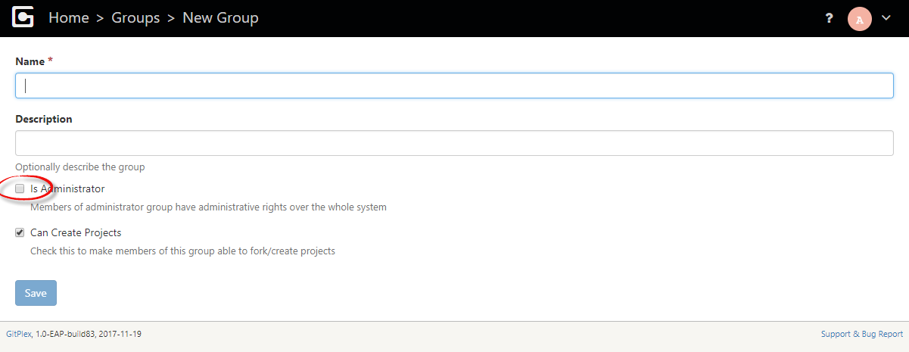
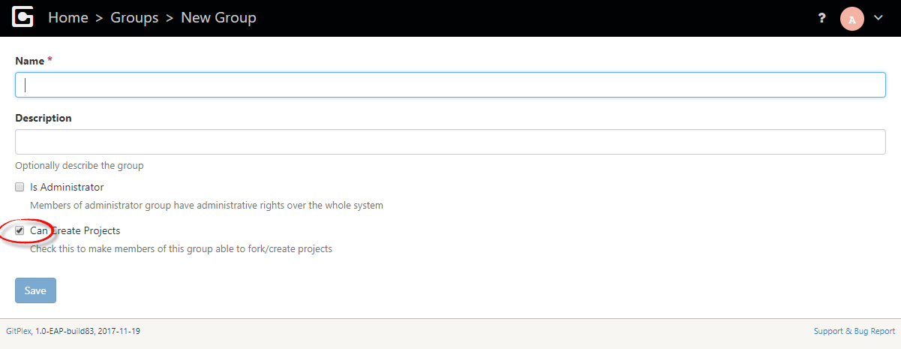

### Control Anonymous Access and Self Registration

Anonymous access and self registration can be controlled as below from [administration menu](Server-Administration-Menu):



### Permission to Administrate Server

To make a user site administrator, create a group with _administrator_ option ticked, and then add the user to group:


### Permission to Create Project

By default users (except for administrators) can not create projects (and hence can not fork projects). To set this permission, create a group with _create projects_ option ticked, and then add the user to group:



### SSL Set Up

By default, OneDev can be accessed via https port 6643 besides the unsecured http port 6610. You may disable the unsecured port by editing _/path/to/onedev/conf/server.properties_ and comment out the _httpPort_ property, followed by restart of OneDev. 

The https port is associated with a sample self-signed keystore as explained in server.properties. You may generate your own certificate or even import an existing certificate. For details, please refer to [Jetty SSL documentation](http://www.eclipse.org/jetty/documentation/current/configuring-ssl.html)

Note that git will reject self-signed certificate by default, and it can be worked around by running below command:
```
git config --global http.sslVerify "false"
```
