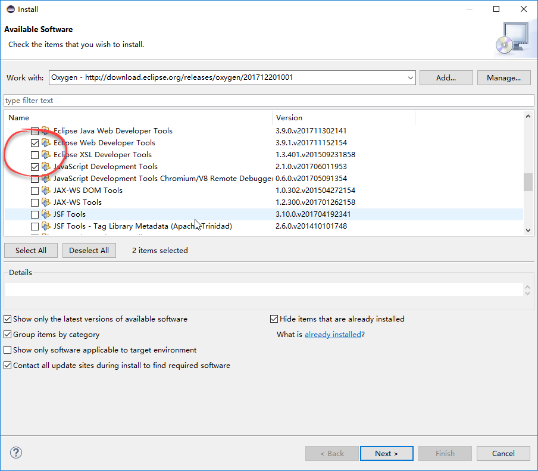
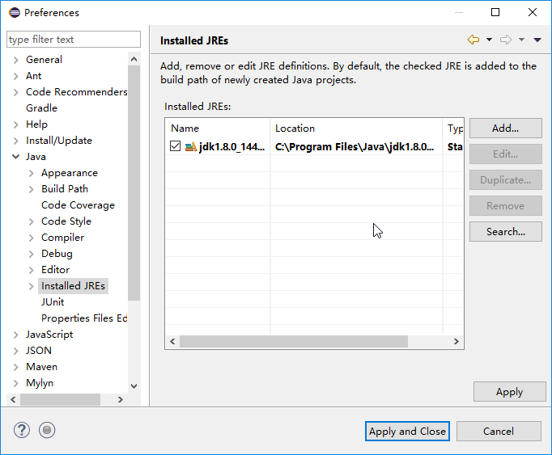
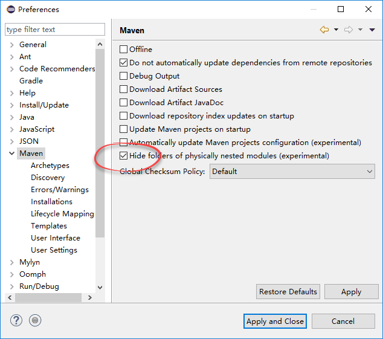
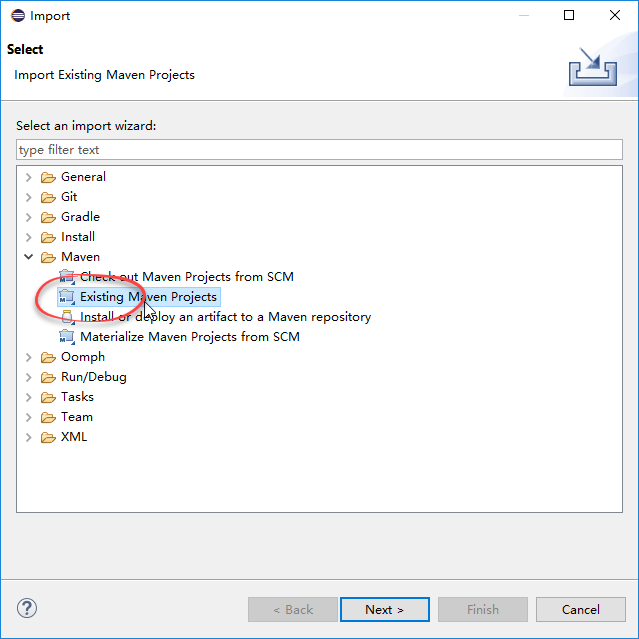
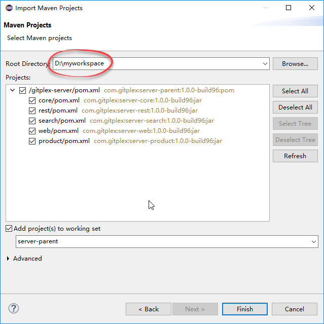
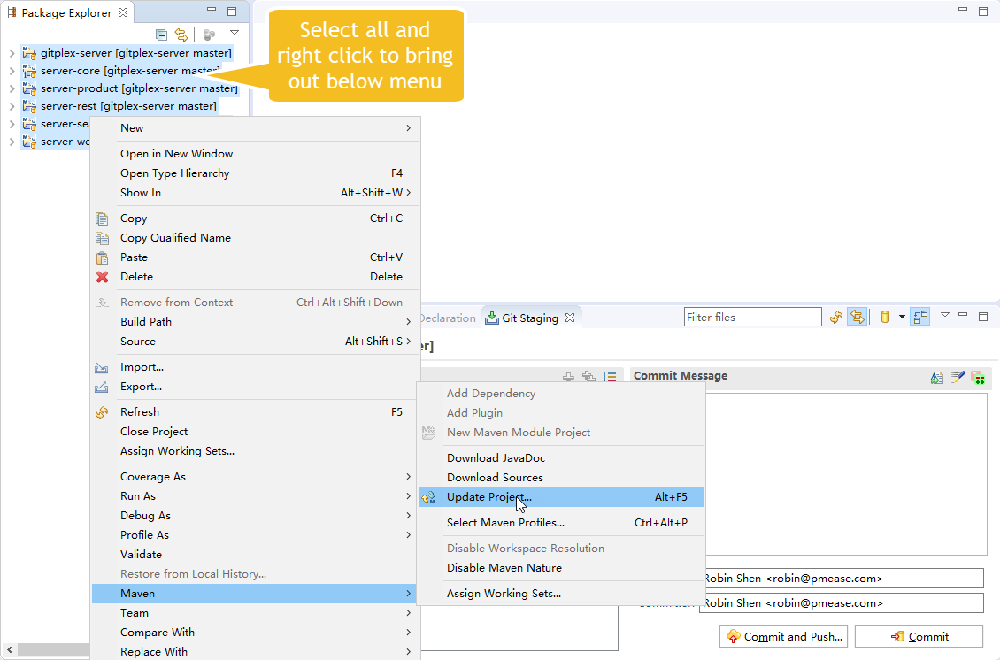
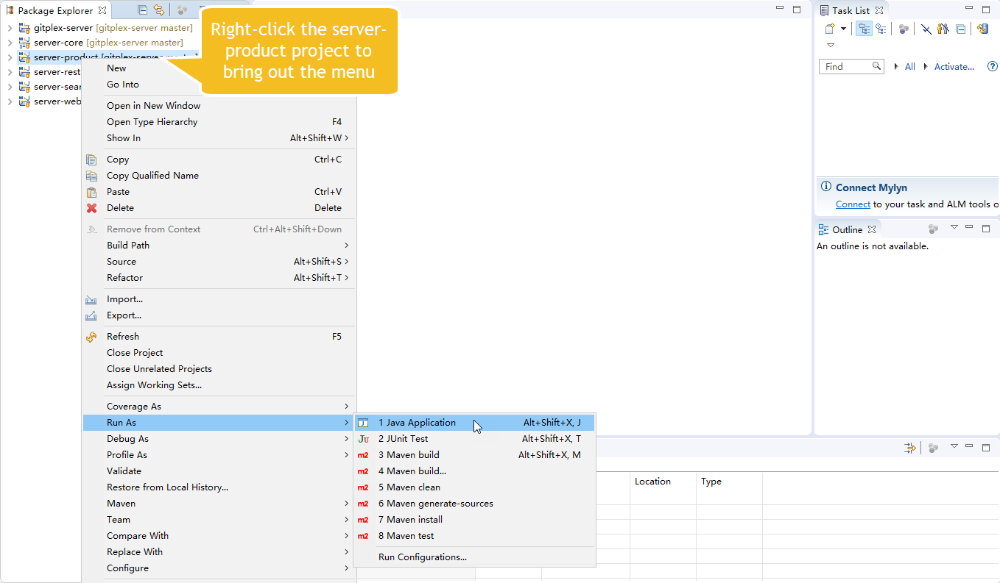
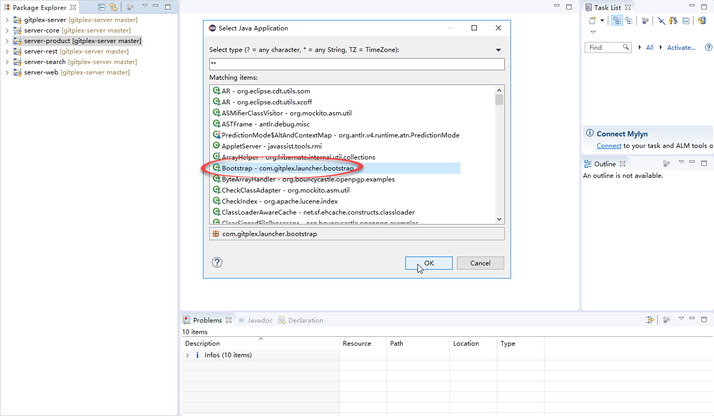

# Set Up Development Environment
---------------

1. Make sure you have [JDK 1.8 or higher](http://www.oracle.com/technetwork/java/javase/downloads/index.html) installed
1. Make sure you have [Git for Windows](https://git-scm.com/download/win) installed
1. Install [Eclipse Oxygen](http://www.eclipse.org/) for Java development
1. Install JavaScript development tools and web development tools from Eclipse menu _Help/Install New Software_ like below:

    
    
1. Create a new directory as Eclipse workspace, for instance, _d:\myworkspace_
1. Clone OneDev source code into a sub directory under Eclipse workspace:

    ```
    git clone https://go.onedev.io/projects/onedev-server d:\myworkspace\onedev-server
    ```
1. Run Eclipse and open workspace _d:\myworkspace_
2. Specify JDK instead of JRE as default. Otherwise, Eclipse will not be able to access Java sources to get help

    
    
2. Edit Maven preferences to check the option _Hide folders of physically nested modules_:

    
    
1. Import existing maven projects as below:

    
    -------------
    
    
1. Wait patiently for Eclipse to download necessary dependencies and build. In case there are compilation errors, update the projects as below:

    
    
1. After build succeeds, you may run OneDev as below:

    
    ----------
    