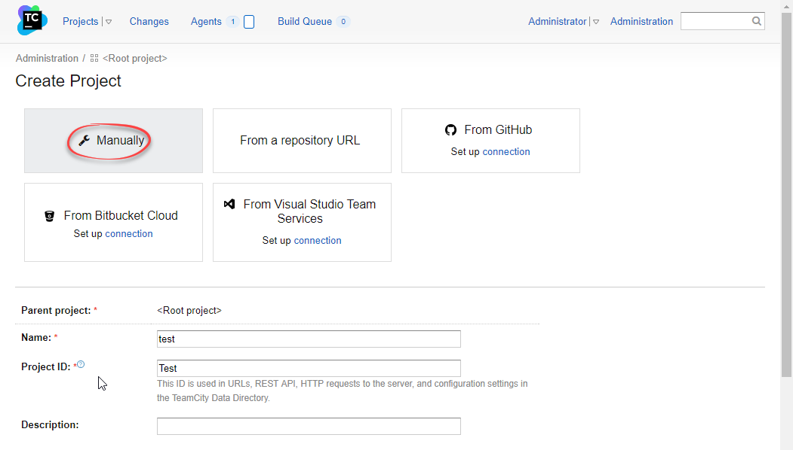
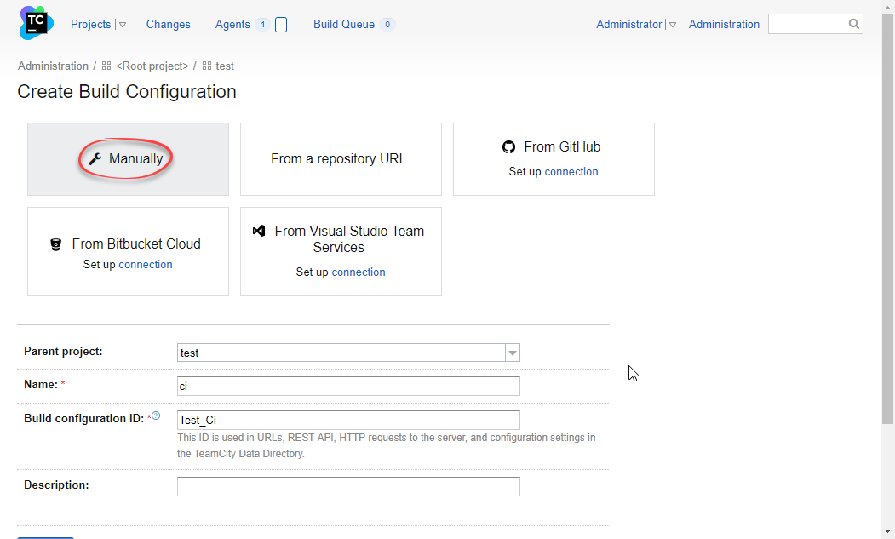
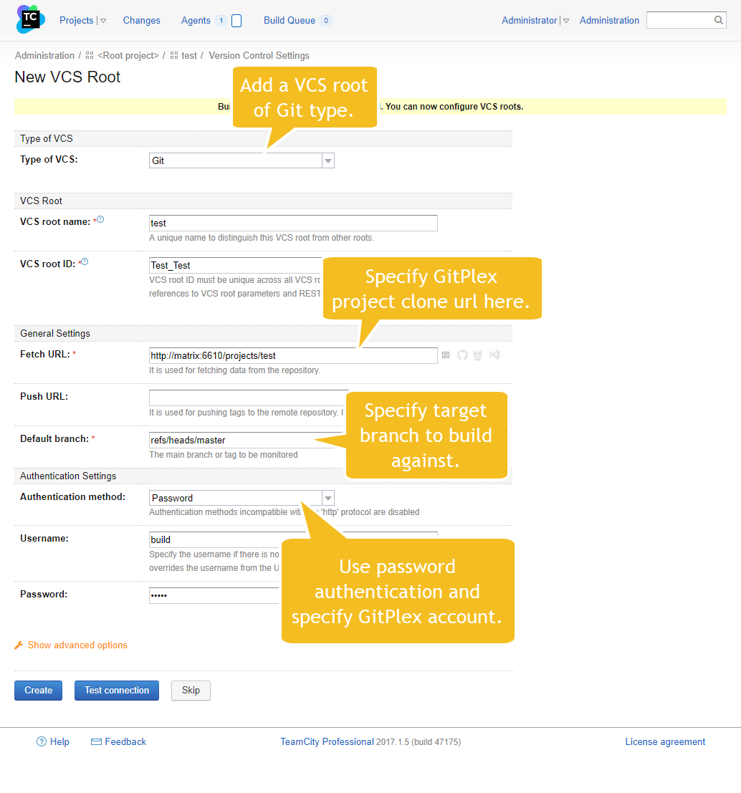
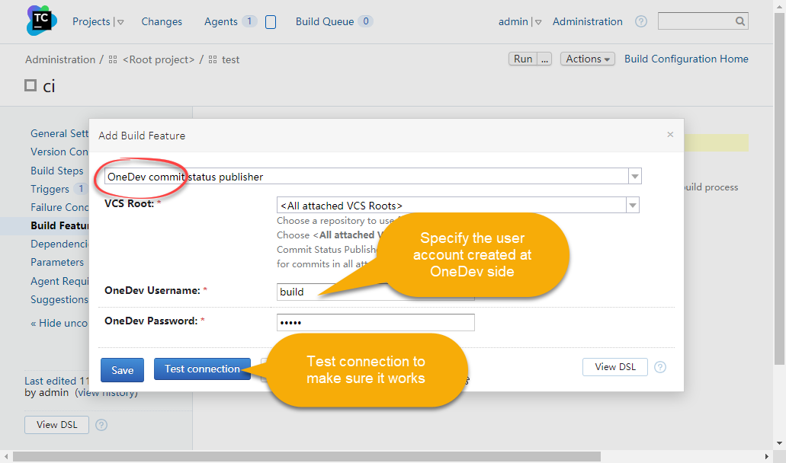
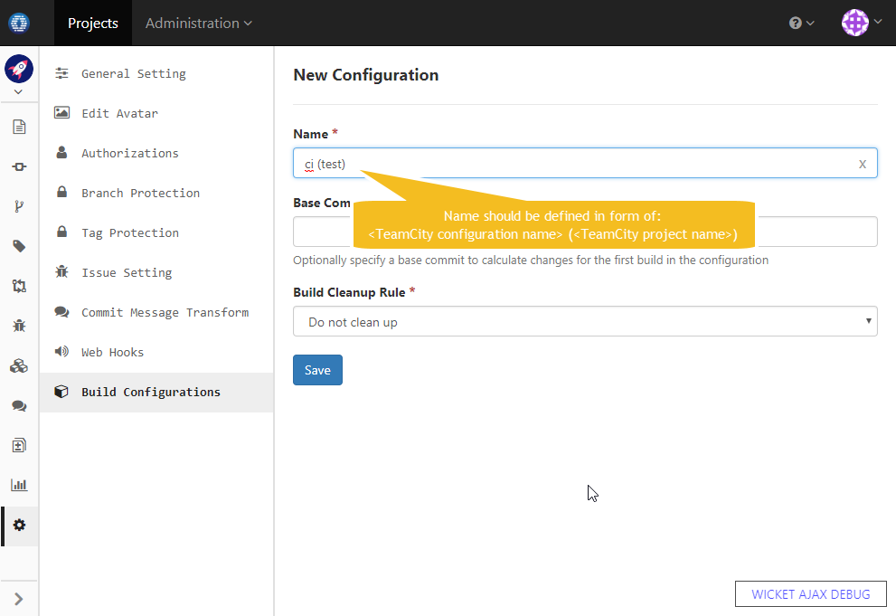
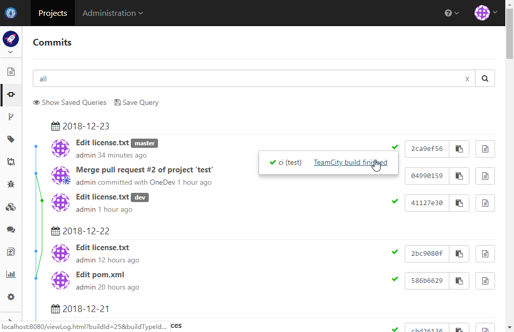
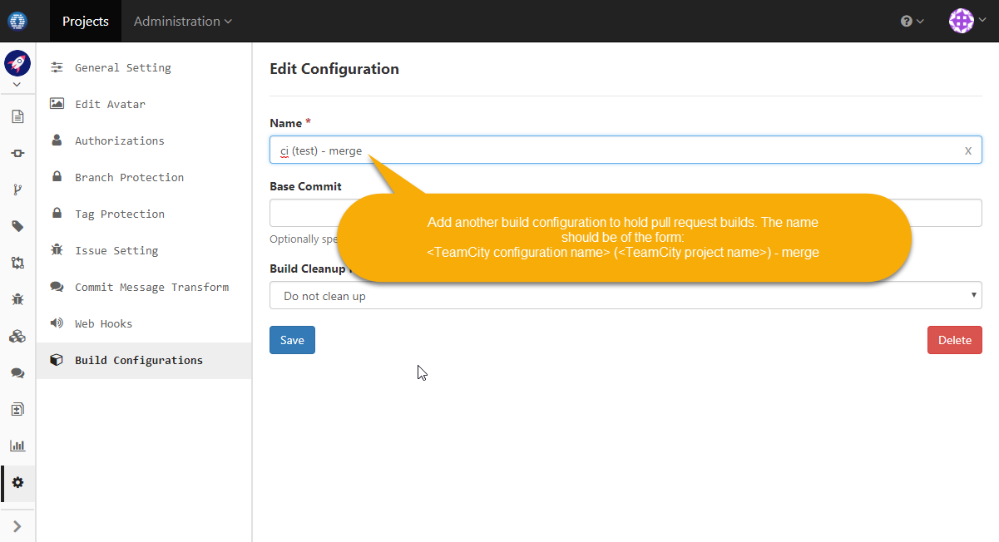
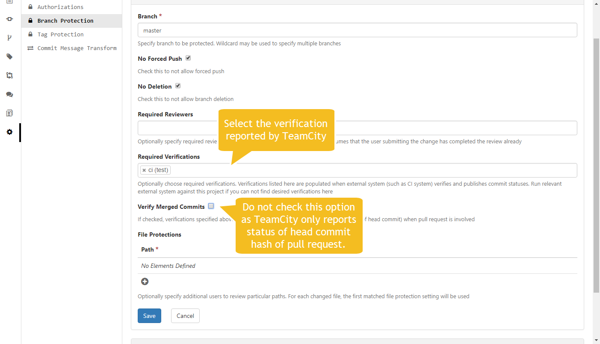
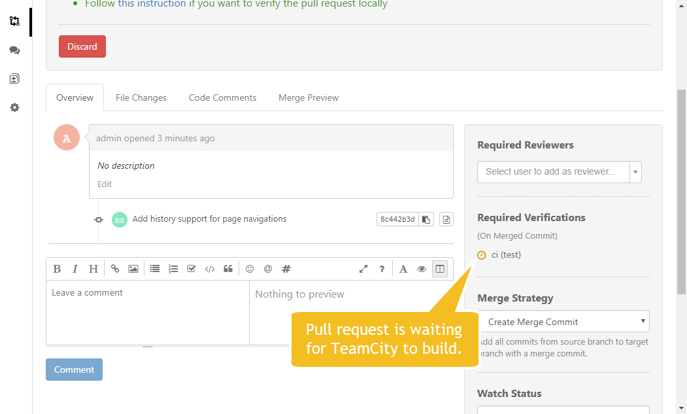
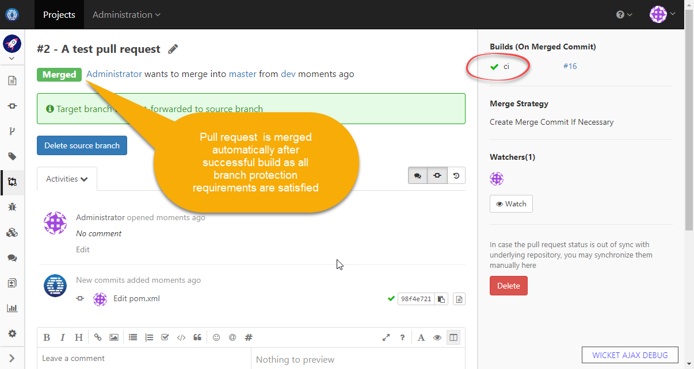

Assume we have a project named _test_ at OneDev side. The clone url is http://matrix:6610/projects/test.

  

### Set up TeamCity to report build status

1. At OneDev side, add an user to be used by TeamCity to access the _test_ project. This user should have _Code Write_ permission over the project.
   
    
	
1.  At TeamCity side, create a _test_ project manually like below:
     
     
     
1. At TeamCity side, create a build configuration under test project, say _ci_:

        
    
1. At TeamCity side, create a VCS root to checkout the test project from OneDev:

    
    
    Make sure the VCS root is attached to the _ci_ configuration
    
1. At TeamCity side, add appropriate build steps to the _ci_ configuration as necessary

1. At TeamCity side, add build feature of type _commit status publisher_ like below:

    
    
    OneDev mimics some GitHub RESTful api, so we can use GitHub publisher here.
    
1. At OneDev side, add a build configuration corresponding to TeamCity project and configuration like below:
	
    
	
1. At TeamCity side, run the _ci_ configuration. After build finishes, check commits page at OneDev side and we will see that corresponding commits are marked with build status.

    
        
### Set up TeamCity to verify pull requests

1. Make sure TeamCity has been [set up to report build status](#set-up-teamcity-to-report-build-status) to OneDev.

1. At TeamCity side, edit the VCS root to specify branch specification as _+:refs/pull/(*/merge)_
   
        
    
1. At TeamCity side, add a VCS trigger to the _ci_ configuration so that it can build automatically upon pull request open or change:

    
   
1. At OneDev side, add a *merging* build configuration corresponding to TeamCity project and configuration like below:
	
    
   
1. At OneDev side, add a branch protection rule to require TeamCity build.

    
    
    For brevity, we do not specify any mandatory reviewers here. The pull request will be merged automatically (unless the merge strategy is specified as "Do Not Merge") after build succeeds. 
        
1. Now let's create a pull request to test the setup.

    

    We will see that the pull request is waiting for TeamCity to build it. After TeamCity builds successfully, the pull request will be merged automatically. 
    
    
