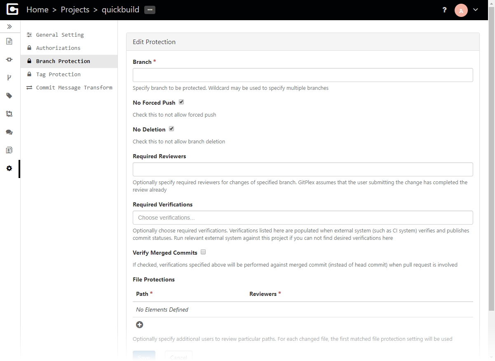
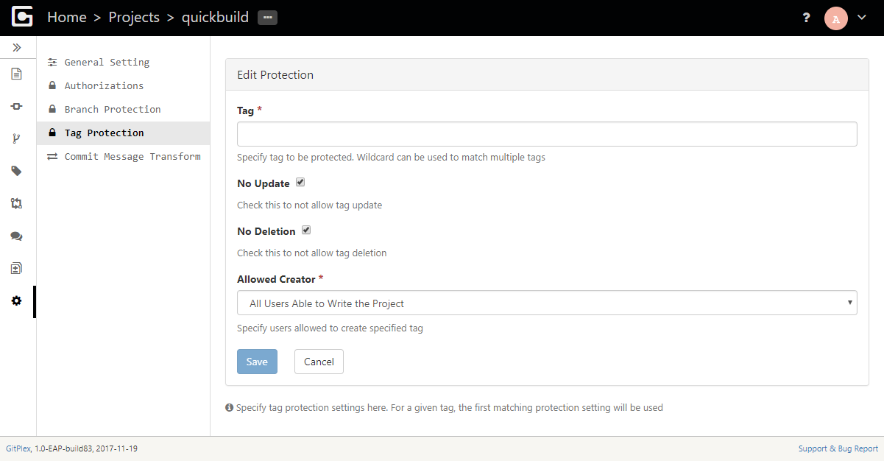

# Branch and Tag Protection
-------------------------------

### Branch protection

Branches can be protected via branch protection rules:

Note that multiple rules can be added and the first matching rule will take effect. 

### Tag protection

Tag can be protected via tag protection rules:

Note that multiple rules can be added and the first matching rule will take effect.