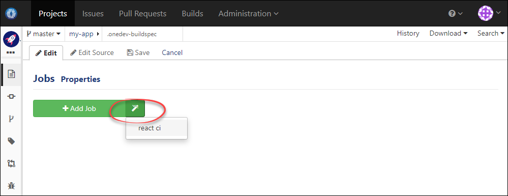

A Five Minutes Tutorial
---

This tutorial demonstrates how to set up a project with git repository, issue tracking and continuous integration.

1. Run below command to start OneDev in docker mode ([other installation methods](installation-guide.md) also available if you want to explore more):

  ```
  docker run -it --rm -v /var/run/docker.sock:/var/run/docker.sock -v $(which docker):/usr/bin/docker -v /opt/onedev:/opt/onedev -p 6610:6610 1dev/server
  ```
  
1. Access url `http://<onedev host>:6610` to set up OneDev

1. From OneDev projects page, add a project, say _my-app_. For demonstration purpose, run below command from your terminal to create a react application:

  ```
  npx create-react-app my-app
  ```
  
1. Change into directory _my-app_, and run below command to push code to OneDev:

  ```
  git remote add origin http://<OneDev host>:6610/projects/my-app
  git push origin master:master
  ```
  Input administration account you've specified when set up OneDev as git credential
  
1. Visit files page of project _my-app_ from OneDev, click link _add build spec_ to bring up the GUI to add build specification for the project. For typical projects, OneDev suggests default job templates like below:

  
  
1. Just use the default template, and save the spec. Now you will see that a CI build is ongoing

  
    
1. Congrats! You've finished the tutorial. Continue to learn how to set up OneDev for [some typical usage scenarios](usage-scenarios.md) if you are interested