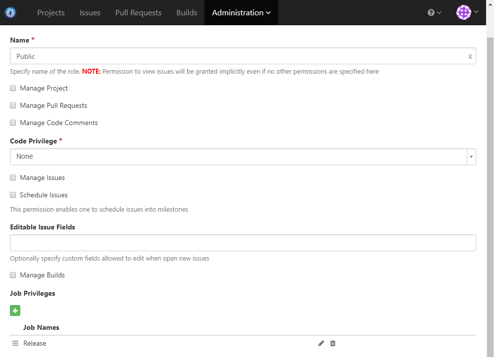
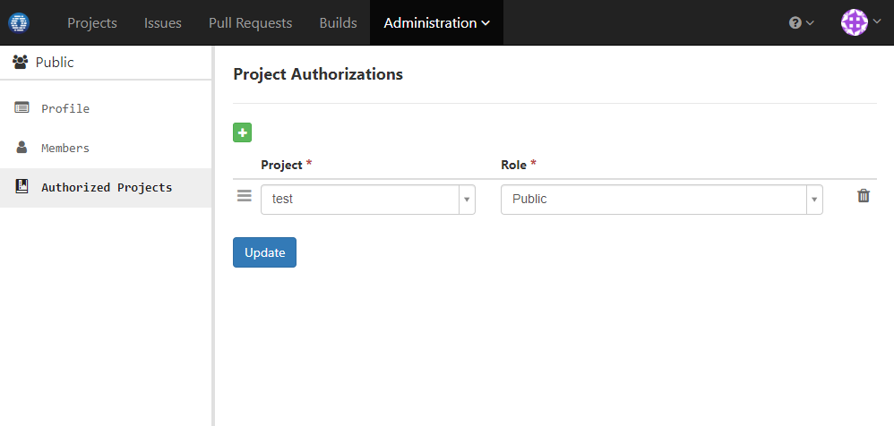
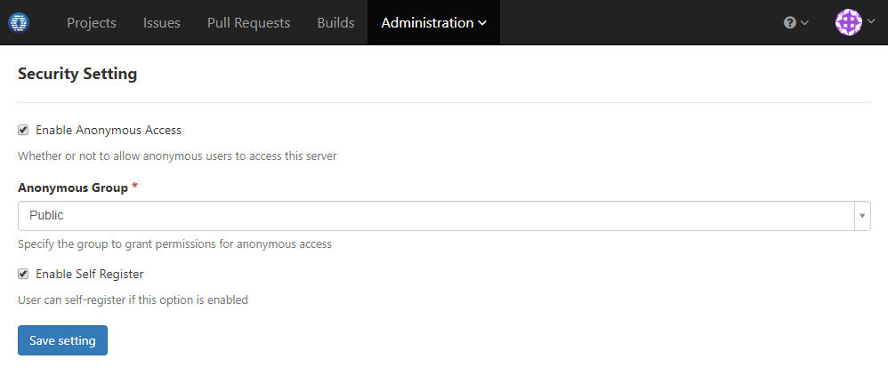

### Usage Scenario

Set up the project so that anonymous user can only access release builds of certain projects

### How to Set Up

  1. Create a role with permission to access release builds like below. Assume the name is _Public_:
  
    
    
  1. Create a group and authorize desired projects with _Public_ role as below. Assume the name is _Public_:

   
   
  1. Edit security setting to enable anonymous access with anonymous group specified as _Public_:

   