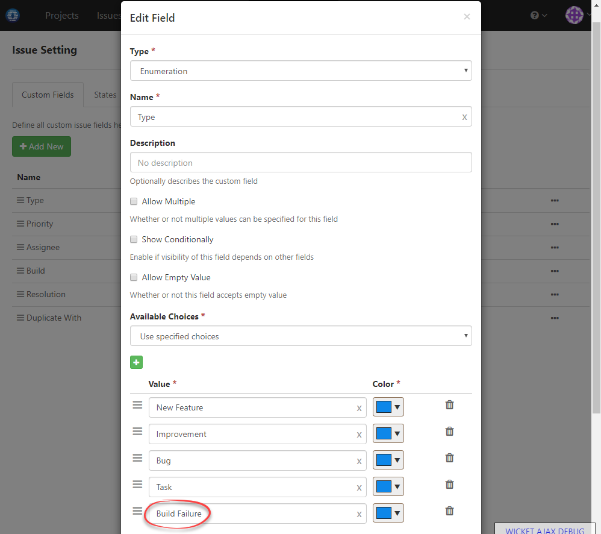
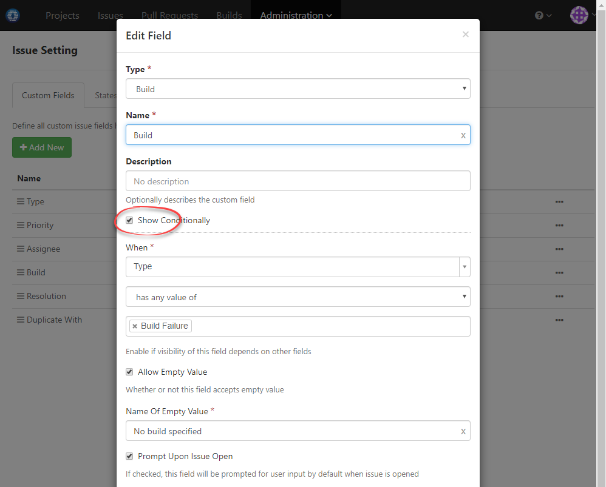
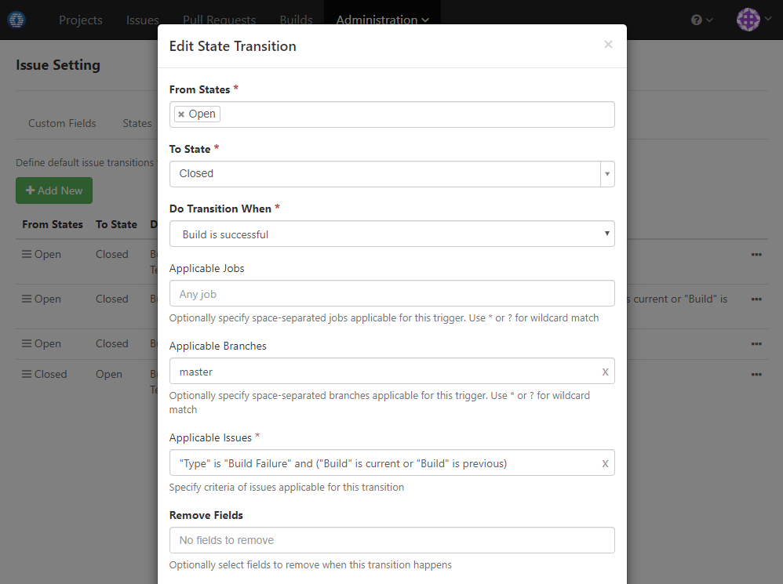
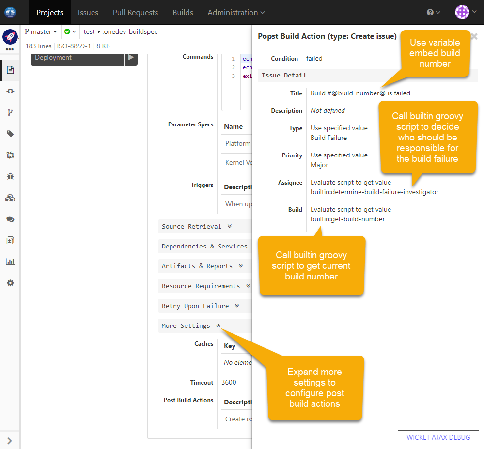

### Usage Scenario

Auto-create an issue and assign to committer for investigation upon build failure on master branch; Auto-close the issue when subsequent build succeeds again

### How to Set Up

1. OneDev ships with an issue type _Build Failure_ like below:

  
  
1. OneDev ships with a custom field _Build_ to record failed builds like below. It is set to show only when issue type is _Build Failure_:

  
  
1. OneDev ships with a transition to close build failure issues when subsequent builds succeed on master branch:

  
  
1. Now the settings to auto-close build failure issues upon build success is in place. We continue to add settings to auto-create such issues upon build failure. To do it, edit onedev build spec to add a post build action _create issue_ like below:

 