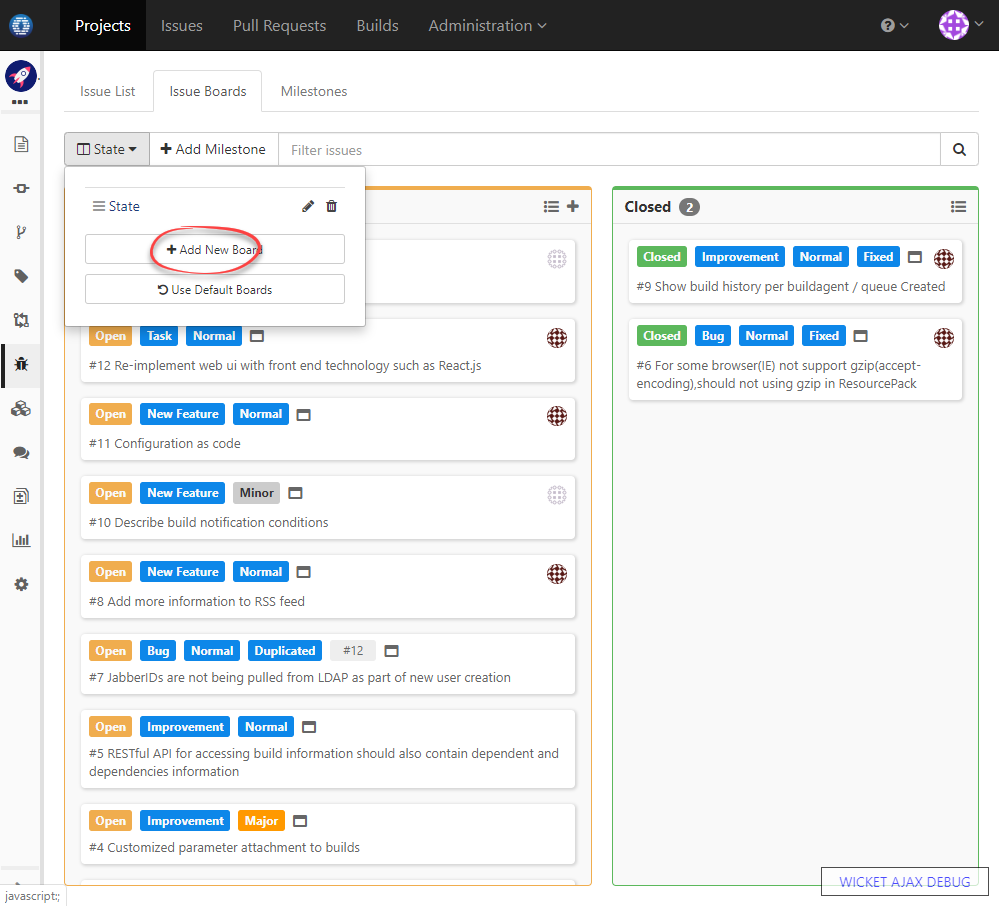
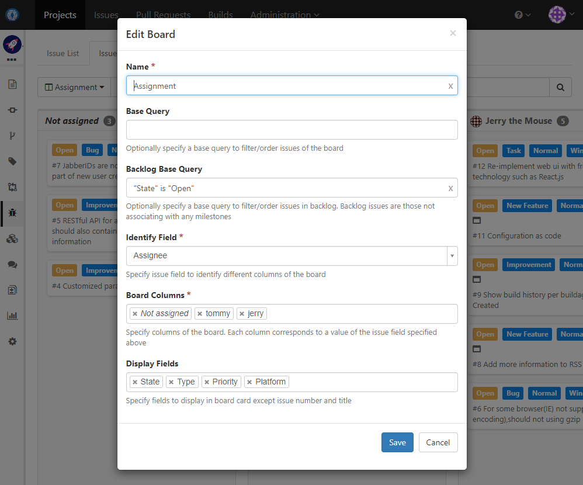
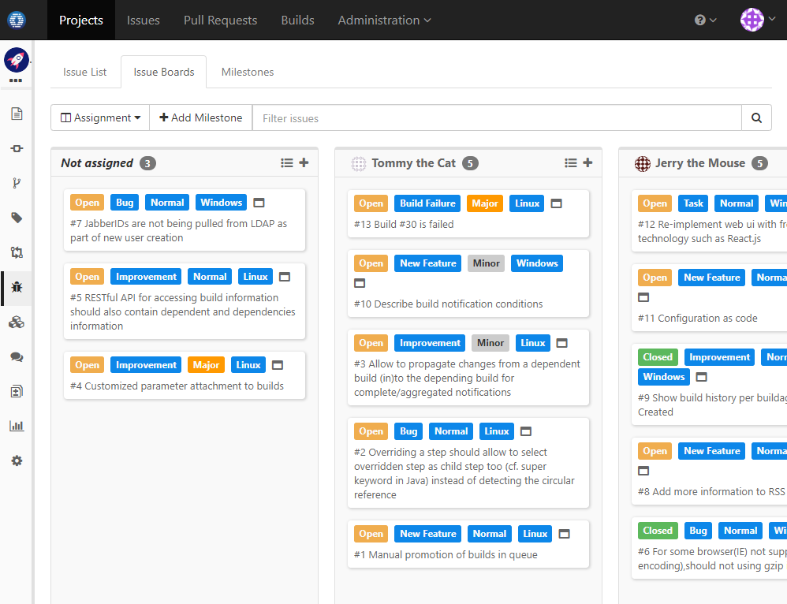

### Usage Scenario

Create an issue board to show open issue assignment between different users

### How to Set Up

1. Change to issue boards page of a project, and add a board like below:

  
  
1. In board setting page, use _Assignee_ as identify field, and choose users as columns

  
  
1. Save the setting, and you will see the board in action:

  