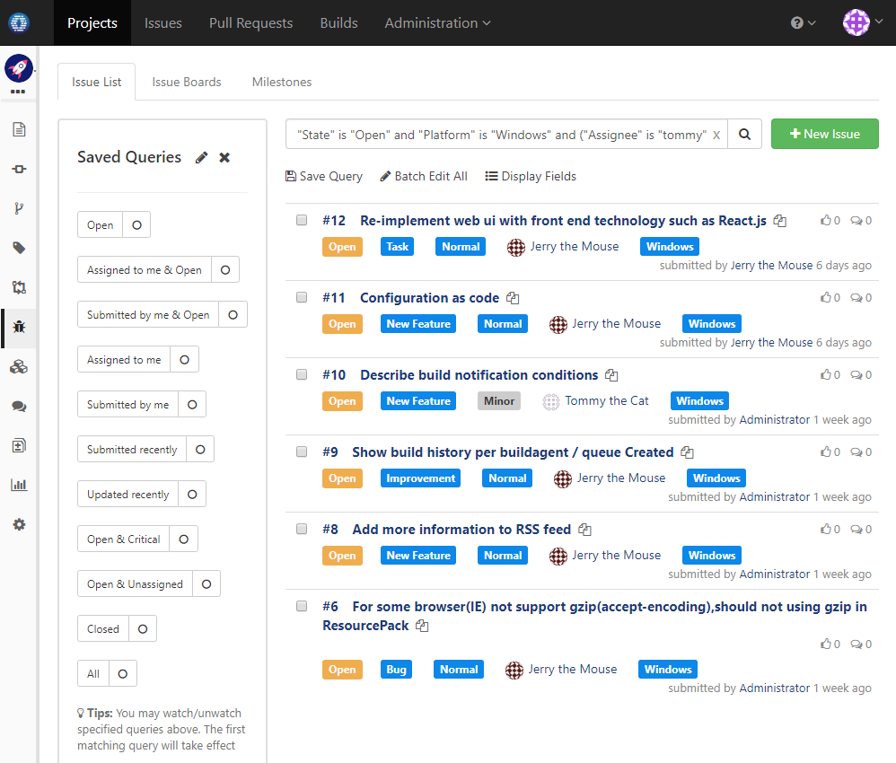

### Usage Scenario

For all open Windows issues assigned to tommy or jerry, reassign to robin

### How to Set Up

1. Change to issues page of desire project, and filter with below query:

  ```
  "State" is "Open" and "Platform" is "Windows" and ("Assignee" is "tommy" or "Assignee" is "jerry")
  ```
   
 
1. Click the _Batch Edit All_ to change assignee to _robin_ and save

  