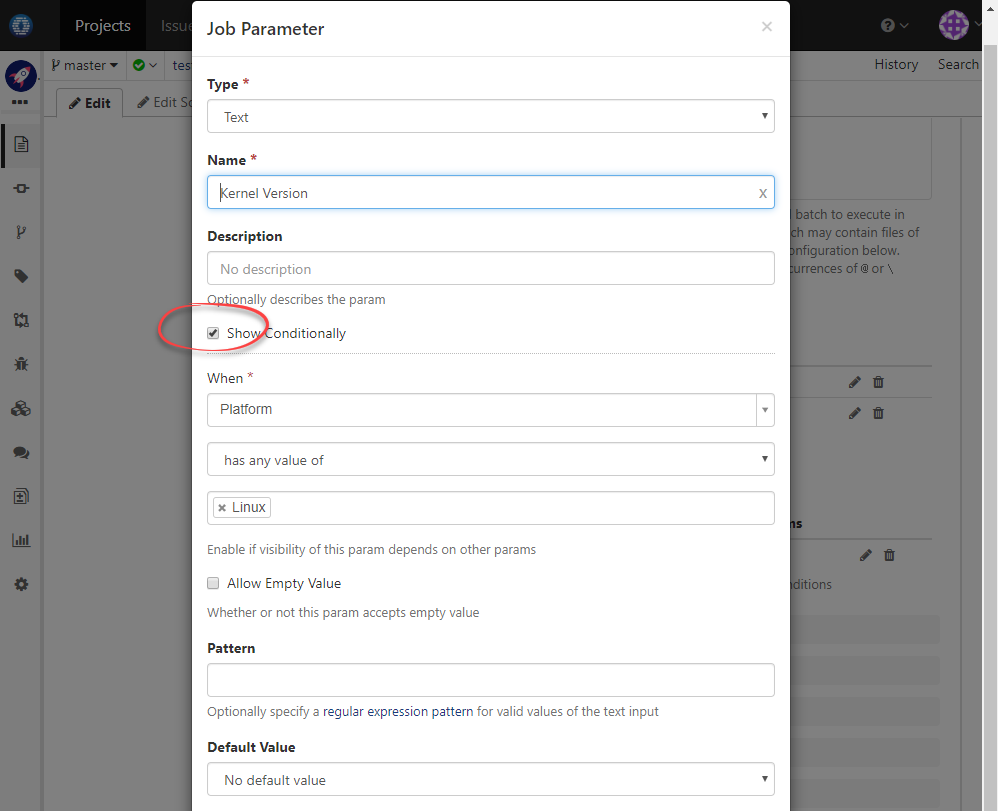

### Usage Scenario

Prompt for _Platform_ and _Kernel Version_ when manually trigger a build. _Kernel Version_ should be displayed only when _Platform_ is specified as _Linux_

### Build Set Up

1. Edit build spec to add param _Platform_ for desired job like below:

  
  
1. Continue to add param _Kernel Version_ like below:

  