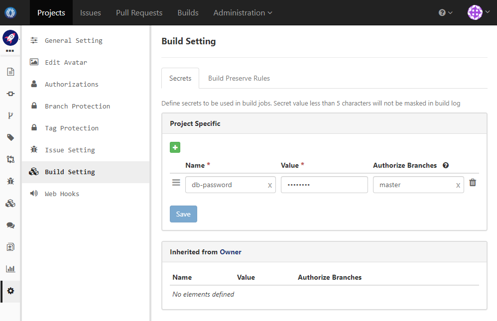
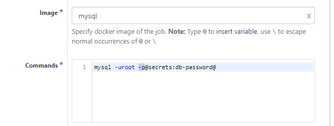

### Usage Scenario

Use secret values in build spec

### How to Set Up

We should never use secret value directly in build spec as otherwise everyone with permission to read code can know the secret. Instead we define it in build setting, and reference it via variables

1. Define a secret say _db-password_ in build setting:

  
  
  We specify authorized branches as master, meaning that only build spec from master branch can access this secret
  
1. Now reference the secret from build spec via variable. For instance:

  
  
Now not only the secret is hidden from build spec, but also its value will be masked from build log and error message