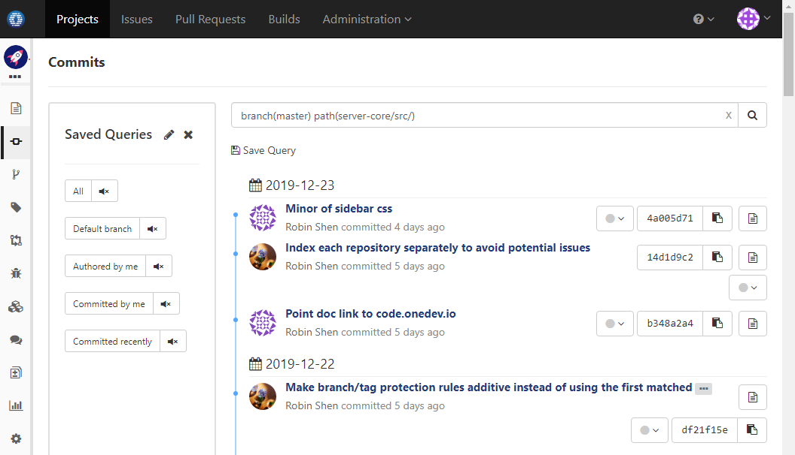
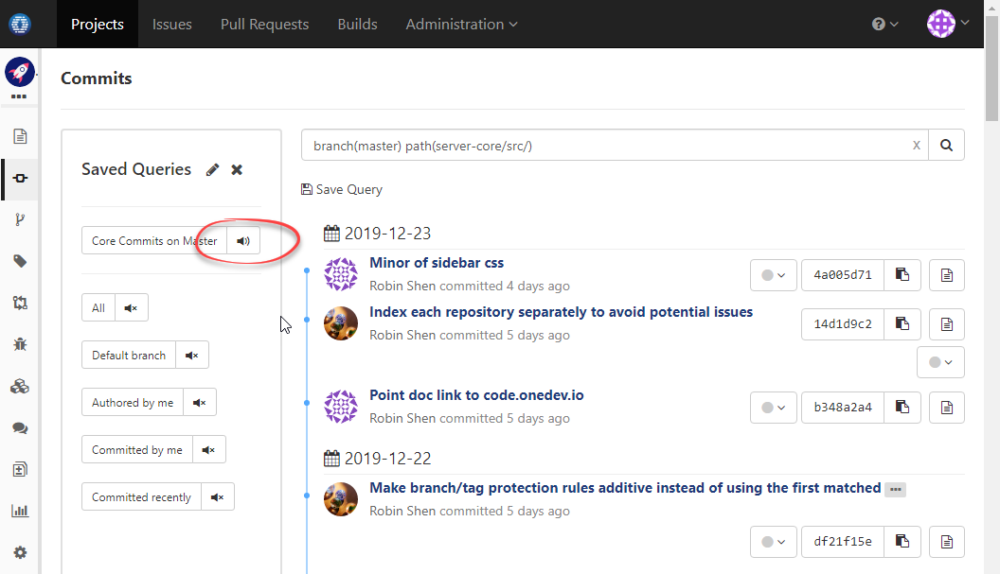

### Scenario

Get notification when files under folder _server-core/src_ are changed on master branch

### How to Set Up

1. From commits page, find all commits touch files under _server-core/src_ on master branch:

  
  
1. Now save the query and subscribe to it:

  