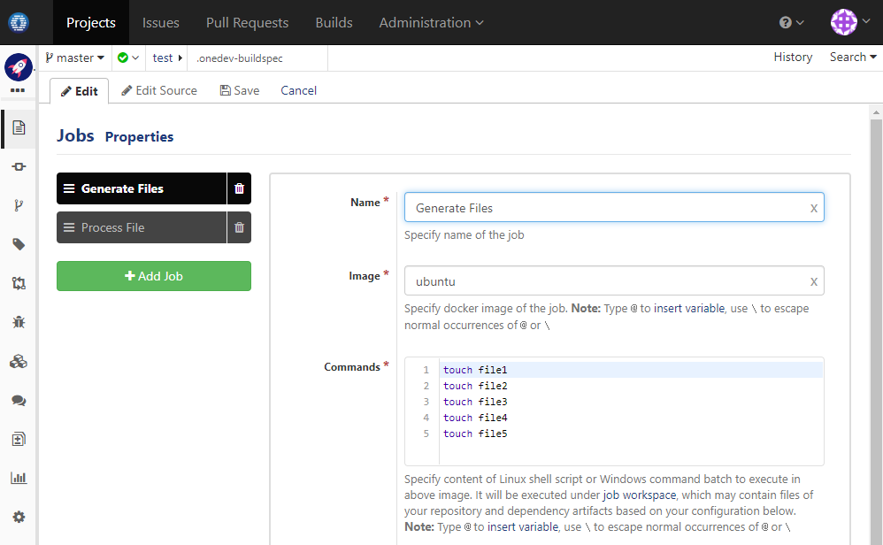
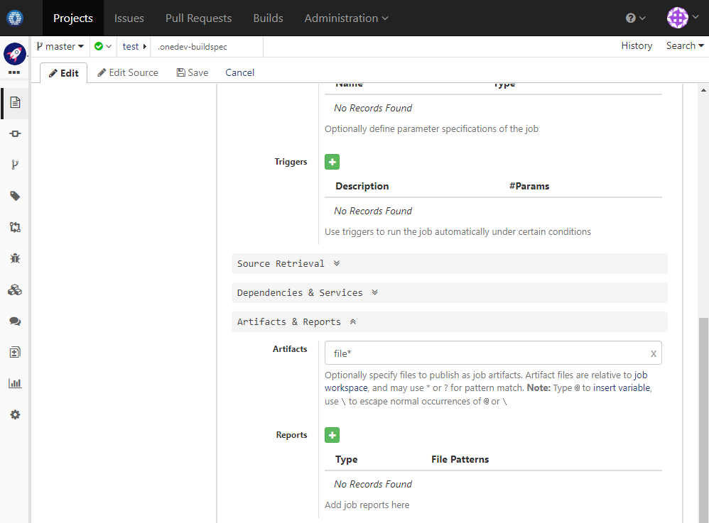
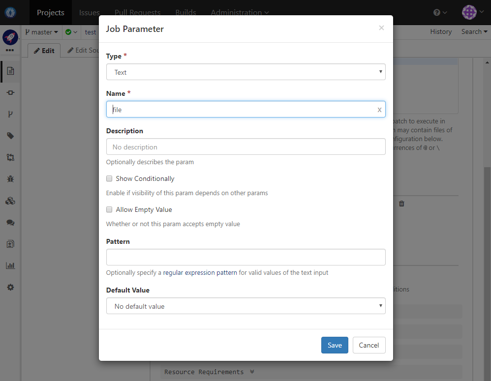
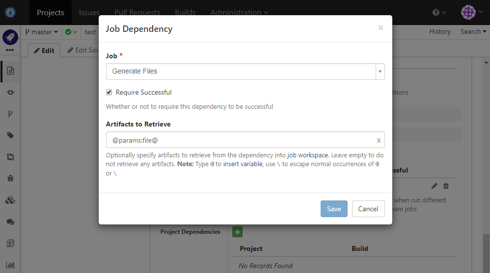
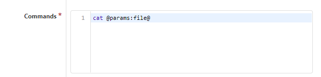

### Usage Scenario

Generate files in one job, and then for each file, process with another job concurrently

### How to Set Up

1. First define a groovy script to return names of published artifacts of current build. We will use this script later:

  
  
1. Edit build spec of a project to add _Generate Files_ job. For demonstration purpose, we run the job on image _Ubuntu_ with below commands:

  
  
1. Expand _Artifacts & Reports_ section of the job to publish generated files as artifacts. Artifacts will be stored on server and can be accessed by other jobs

  
  
1. Now add another job _Process File_ running on _Ubuntu_, and add parameter _file_:

  
  
1. Expand _Dependencies & Services_ section to add a job dependency to retrieve artifact specified by parameter _file_ from job _Generate Files_:

  
  
1. Edit commands of the job to process received file. For demonstration purpose, we simply print content of the file:

  
  
1. Expand _More Settings_ of job _Generate Files_ and add a post build action to run job _Process File_.  Configure parameter _file_ to use list of file names returned by the script we defined in the first step. For each element in the list, OneDev will create an instance of specified job using that element as parameter

  
  
1. Save the build spec and run job _Generate Files_. OneDev will create an instance of _Process File_ to process each generated file concurrently in multiple containers