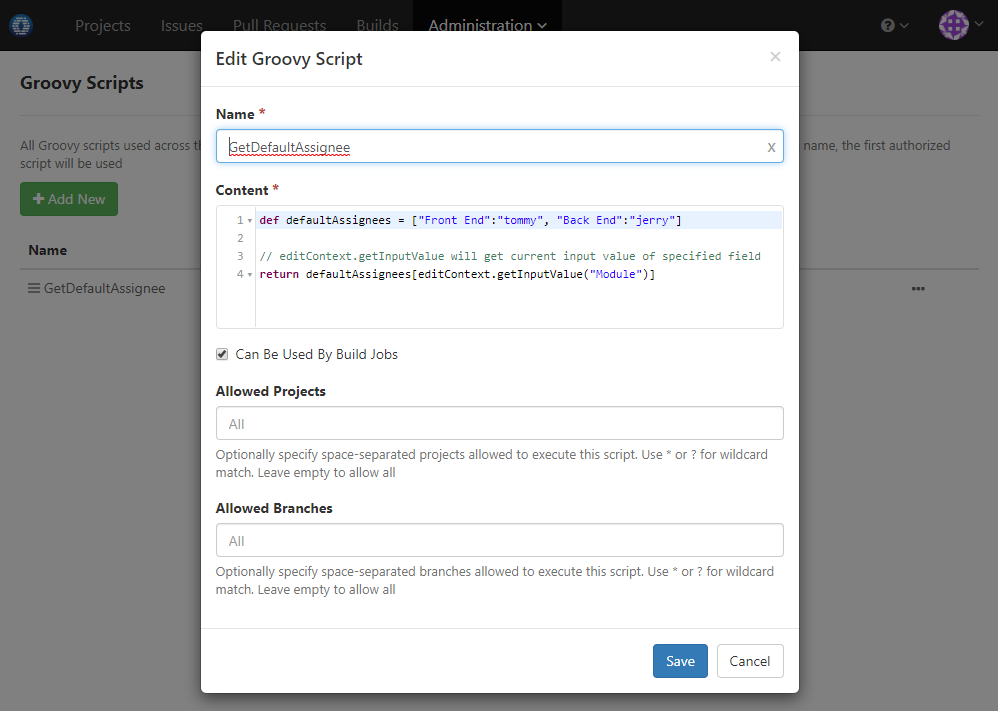

### Usage Scenario

Add custom field _Module_ and assign issue of particular module to module leader automatically

### How to Set Up

1. Add custom issue field _Module_ from issue setting of administration menu:

  
  
1. Define a groovy script to return corresponding module leader based on module name

  
  
1. Modify custom issue field _Assignee_ to use groovy script defined above as default value:

  