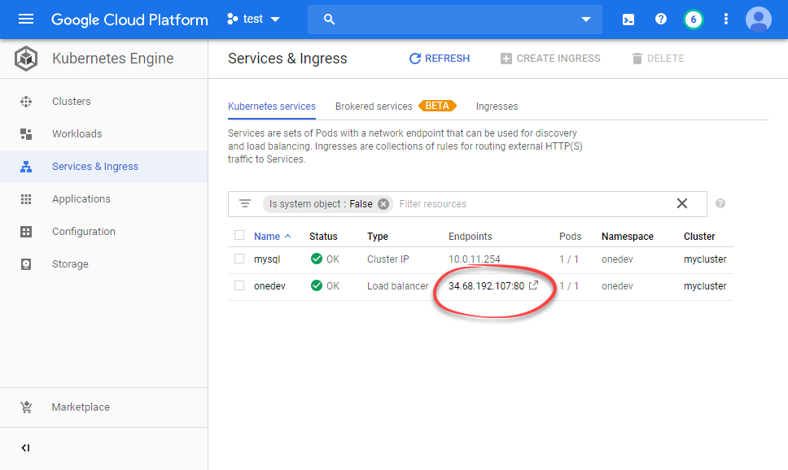

# Deploy into Kubernetes Cluster
--------

### Installation

1. Select desired [OneDev release](https://code.onedev.io/projects/onedev-server/builds?query=%22Job%22+is+%22Release%22)  and download _k8s-resources.zip_
2. Unzip the file, change into directory _production_, change node selectors, memory setting and disk setting if necessary, and then run below command from this directory:
  ```
  kubectl apply -k .
  ```
3. OneDev resources will be created under namespace _onedev_. Wait a while for pods in this namespace to be up and running. Then access ip address assigned by onedev load balancer to access OneDev. For instance on Google Kubernetes Engine, one can access OneDev server this way:

 
 
Please note:

1. Besides creating resources in namespace _onedev_, a cluster role _onedev_ and associated cluster role binding _onedev_ will be created in default namespace. This is necessary as OneDev needs to be granted some cluster-wide permissions to run builds as pods. For details, please check file _base/cluster-roles.yaml_
2. OneDev will create two persistent volume claims, one to store MySQL database files, and another to store OneDev data including repositories. The actual place of these volumes varies depending on your Kubernetes cluster config. On Google Kubernetes Engine, they will be created as Google persistent disks