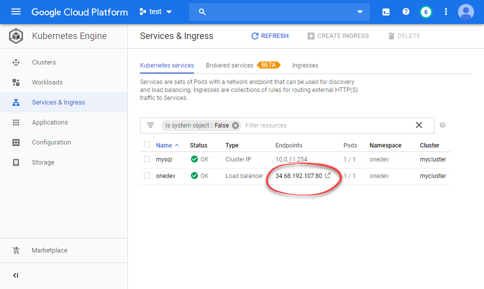

# Deploy into Kubernetes Cluster
--------

1. Select desired [OneDev release](https://code.onedev.io/projects/onedev-server/builds?query=%22Job%22+is+%22Release%22)  and download _k8s-resources.zip_
2. Unzip the file, change into directory _production_, modify node selectors, memory setting and disk setting if necessary, and then run below command from this directory:
  ```
  kubectl apply -k .
  ```
3. OneDev resources will be created under namespace _onedev_. Wait a while for pods in this namespace to be up and running. Then access ip address assigned by onedev load balancer to access OneDev. For instance on Google Kubernetes Engine, one can access OneDev server this way:

 