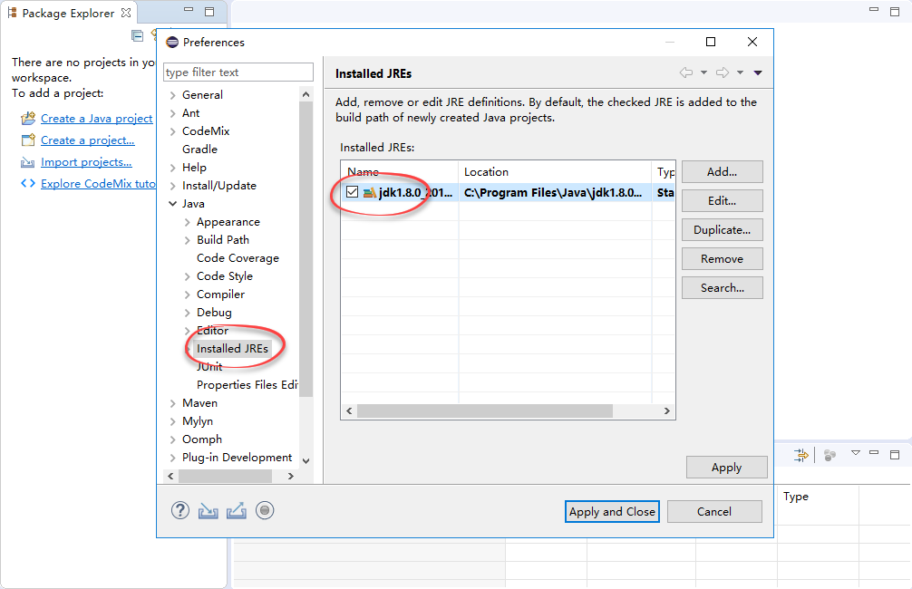
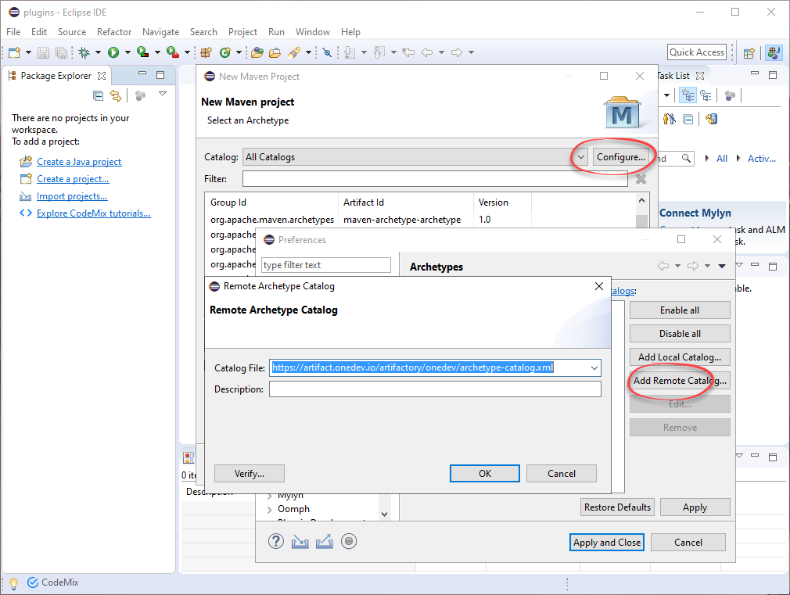
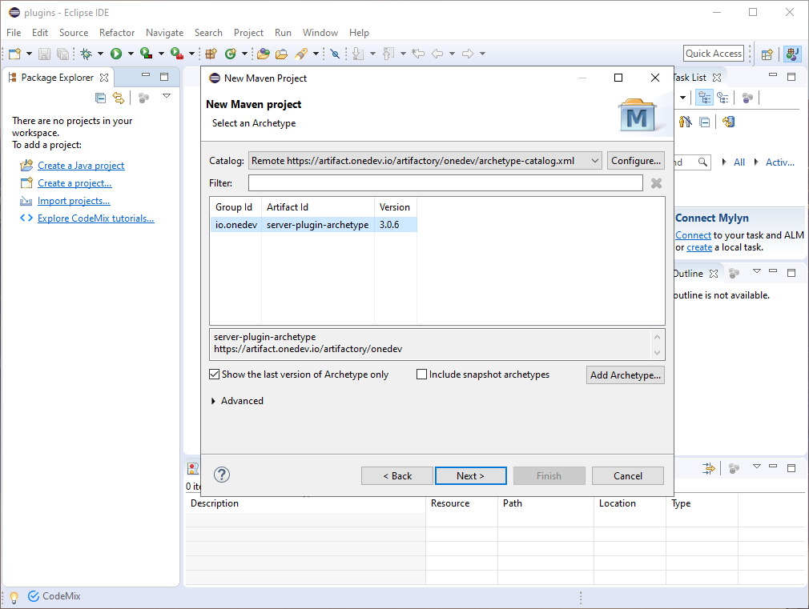
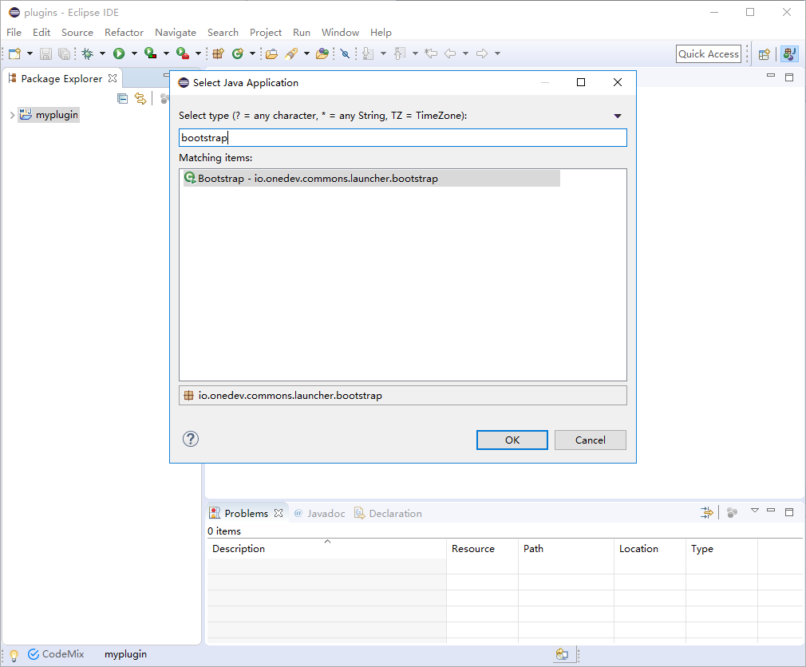

# Develop Standalone Plugins
------------

Standalone plugins do not ship together with OneDev, and can be developed without OneDev source code. Follow below steps to set up standalone plugin development environment:

1. Switch to a new Eclipse workspace, and specify JDK8 as default Java runtime

   

2. Then switch to Maven setting to check the _Hide folders of physically nested modules_ option 

   

3. Apply the changes, and create a new Maven project as below

   

4. Make sure **NOT** to tick the _create simple project_ option in next page 

   

5. Click the next button to go to next page. If this is the first time you adding a OneDev plugin, you will need to click the _configure_ button to add OneDev remote archetype catalog. The catalog url is: 
   https://artifact.pmease.com/artifactory/pmeaseRepo/archetype-catalog.xml. Apply and close the catalog adding dialog, Eclipse should list all archetypes relating to OneDev. If you added the catalog before, just input _io.onedev_ to filter the archetype

   

6. From OneDev archetype list page, choose desired version and proceed to next page

   

7. Specify group id, artifact id and version of the new plugin. Note that for standalone plugins, group id should **NEVER** be _io.onedev_

   

8. Finish adding the plugin, and Eclipse will take a while to download dependencies and build the plugin. To run the plugin from Eclipse, right click the project, and select run as Java application

   

9. From the popup dialog, run class _io.onedev.commons.launcher.bootstrap.Bootstrap_ and start OneDev

   

10. To package the plugin after development, run _mvn clean package_ under the plugin folder. A plugin zip will be created under the target directory, for instance _com.example.myplugin-0.0.1-SNAPSHOT.zip_. This zip contains plugin code and necessary dependencies. To deploy the plugin, copy the zip into _site/lib_ folder of a OneDev installation and restart OneDev