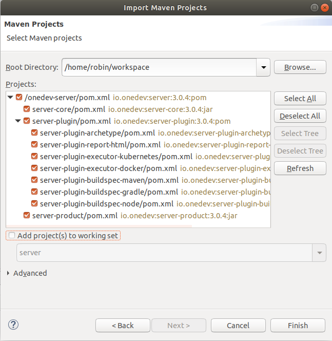

# Development Environment Setup
-----------

### Procedure
1. Make sure you have [JDK 1.8](http://www.oracle.com/technetwork/java/javase/downloads/index.html) installed
1. Make sure you have [Git](https://git-scm.com/) version 2.11.1 or higher installed
1. Install [Eclipse Oxygen or higher](http://www.eclipse.org/) for Java development
1. Install JavaScript development tools and web development tools from Eclipse menu _Help/Install New Software_ like below:

    
    
1. Create a new directory as Eclipse workspace. Let's assume it to be _/home/robin/workspace_
1. Clone OneDev source code into a sub directory under Eclipse workspace:

    ```
    cd /home/robin/workspace
    git clone https://code.onedev.io/projects/onedev-server
    ```
1. Run Eclipse and open workspace _/home/robin/workspace_
2. Specify JDK instead of JRE as default. Otherwise, Eclipse will not be able to access Java sources to get help

    
    
2. Edit Maven preferences to check the option _Hide folders of physically nested modules_:

    
    
1. Import existing maven projects as below:

    
    -------------
    
    
1. Wait patiently for Eclipse to download necessary dependencies and build. In case there are compilation errors, update the projects as below:

    
    
1. After build succeeds, you may run OneDev as below:

    
    ----------
    
    
### Trouble Shooting

1. In case there are compilation errors even if you've updated the project as described in step 11 above, run below from command line to make sure it succeeds:
  ```bash
  cd /home/robin/workspace/onedev-server
  mvn clean package
  ```
  If it still does not work, most probably your network has some issues downloading dependencies. Otherwise go back to Eclipse, **refresh** and **update** all projects, then errors should go away.
  
1. In case OneDev reports _Unable to find product directory_ upon running. Please check launched configuration and make sure project is specified as _server-product_ as below:
    
    
    
    If you still get the error, check if directory _/home/robin/workspace/onedev-server/server-product/target/sandbox_ exists. This directory should be created automatically as long as compilation is successful in Eclipse