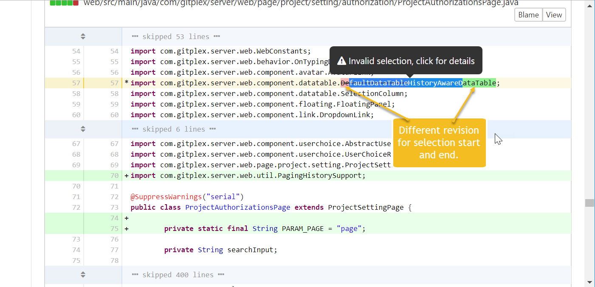

OneDev allows to select a range of text while comparing revisions to create permanent links or add comments. However some selections are considered invalid:

1. If the selection contains unexpanded lines like below:

    
  
    In this case, you need to expand contained lines and select them again.
  
1. If begin and end of the selection are on different revision like below:

   
  
   

As long as selection begin and end are on same revision, the selection will be valid even if the selection body contains other revision as below:
  
   
  
   