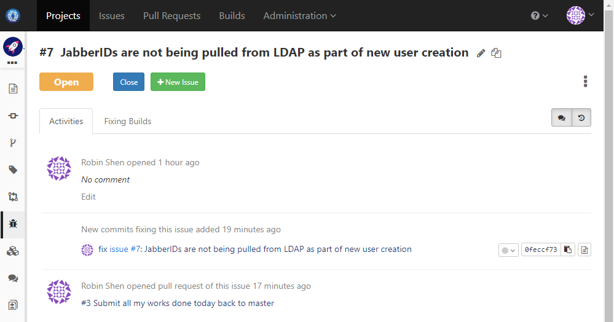
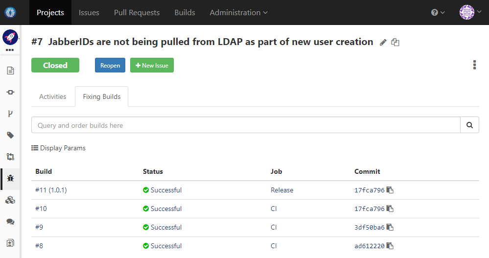
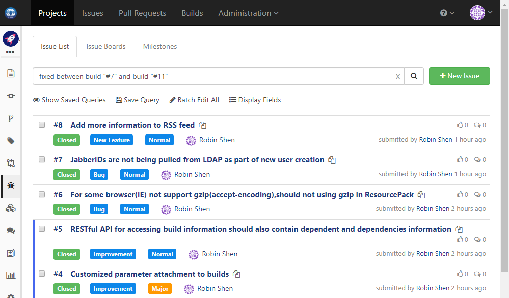
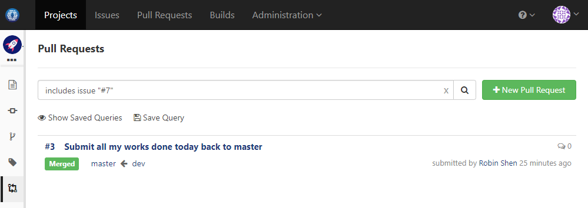
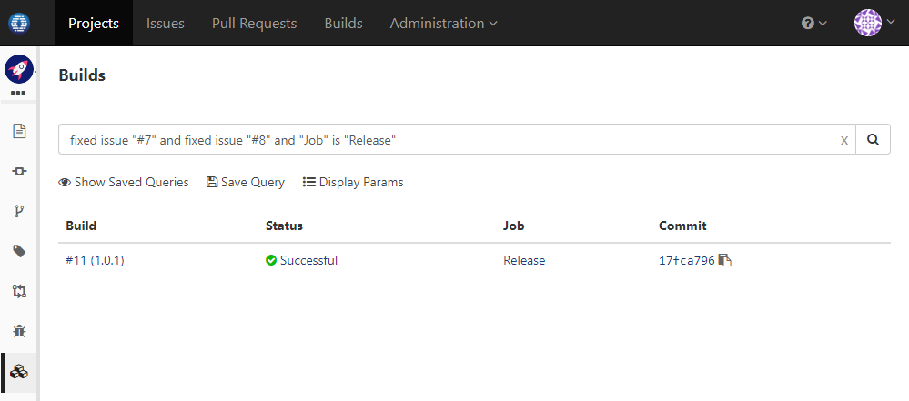

### Usage Scenario

Fix issues via commit message to link issues, commits, builds and pull requests

### How to Set Up

Issues can be fixed via commit message with below pattern:
```
[fix|fixing|fixed|resolve|resolving|resolved] issue #[issue number] [:optional issue description]
```
For instance: `fix issue #100`, `resolve issue #200: Add Kubernetes support`

With this info, OneDev is able to set up cross references between issue, commit, and build. For instance, you may:

* Get to know which commit a issue is fixed in, and what pull request it is currently being reviewed:

  
  
* List all builds containing fix of the issue:

  
  
* List all issues fixed between any two builds:

  
  
* List all pull requests containing the issue:

  
  
* List all release builds fixing particular issues:

  