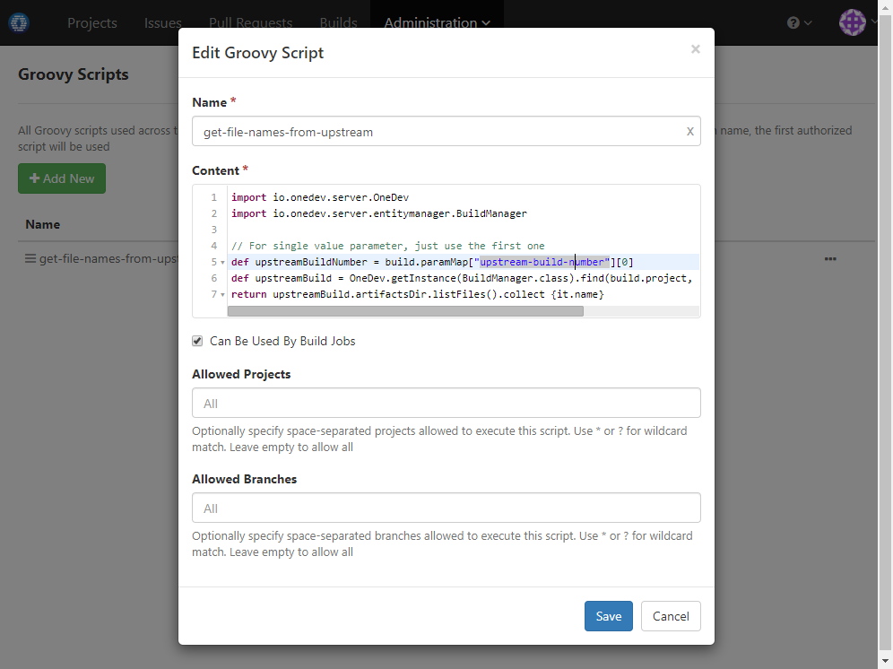
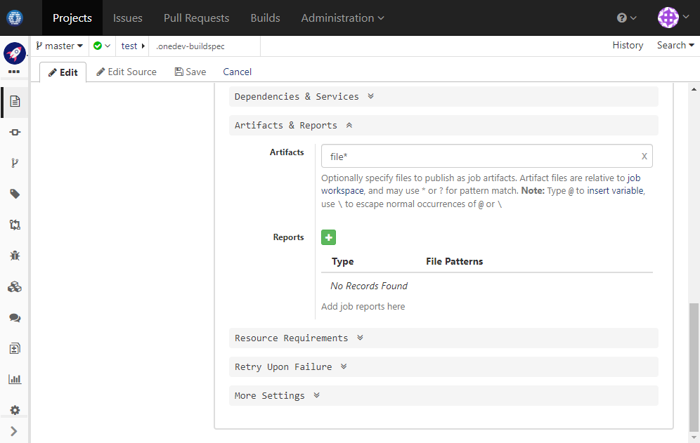

### Usage Scenario

Generate files in one job, process each file concurrently in the second job, and collect processed results in the third job

### How to Set Up

1. Define a groovy script to get list of published artifact names from upstream build whose number is passed via parameter _Upstream-Build-Number_:

  
  
  Content of the script:
  ```groovy
  import io.onedev.server.OneDev
  import io.onedev.server.entitymanager.BuildManager

  // Variable "build" represents the build being triggered currently
  // For single value parameter, just use the first one
  def upstreamBuildNumber = build.paramMap["upstream-build-number"][0]
  def upstreamBuild = OneDev.getInstance(BuildManager.class).find(build.project, upstreamBuildNumber as Long)
  return upstreamBuild.artifactsDir.listFiles().collect {it.name}
  ```
  
1. Edit build spec to add job _Generate Files_ with below command:

  
  
  Command to generate files:
  ``` bash
  echo 1 > file1
  echo 2 > file2
  echo 3 > file3
  ```
  
1. Continue to edit job _Generate Files_. In _Artifacts & Reports_ section, publish generated files so that job _Process File_ can retrieve:

  
  
1. Add  job _Process File_ with parameter _file_ which will be used to hold name of the file being processed

  
  
  For demonstration purpose, the command simply prepend message _processed_ to the file content:
  ``` bash
  echo "processed $(cat @params:file@)" > @params:file@
  ```
  
1. Continue to edit job _Process File_. In _Dependencies & Services_ section, add a job dependency to retrieve the published file with name equal to parameter _file_:

  
  
1. Continue to edit job _Process File_. In _Artifacts & Reports_ section, publish generated files so that job _Collect Files_ can retrieve:

  

1. Add job _Collect Files_ with parameter _upstream-build-number_ which will be used to hold number of the build generating files

  
  
  The command `cat files*` simply prints contents of all collected files
  
1. Continue to edit job _Collect Files_. In _Dependencies & Services_ section, add a job dependency to _Process File_ with param _file_ set to evaluated result of the groovy script we added in the first step. For each of the name returned from the script, the job will be triggered once and the processed file will be collected back:

  
  
1. Go back to edit job _Generate Files_. In _More Settings_ section, add a post-action to trigger job _Collect Files_, with param _upstream-build-number_ set to value of current build:

  
  
1. Done! Now run job _Generate Files_. After it succeeds, three builds of job _Process File_ will be running to process generated files. After all files are processed, job _Collect Files_ will be running to collect the results

  