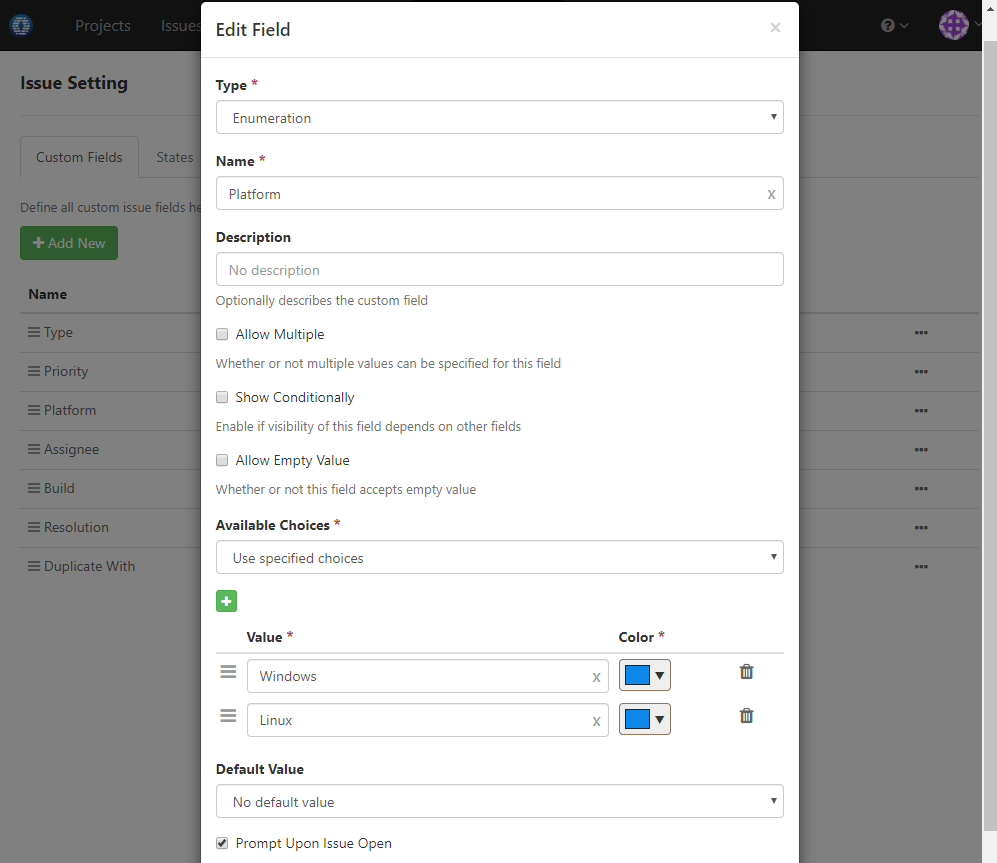
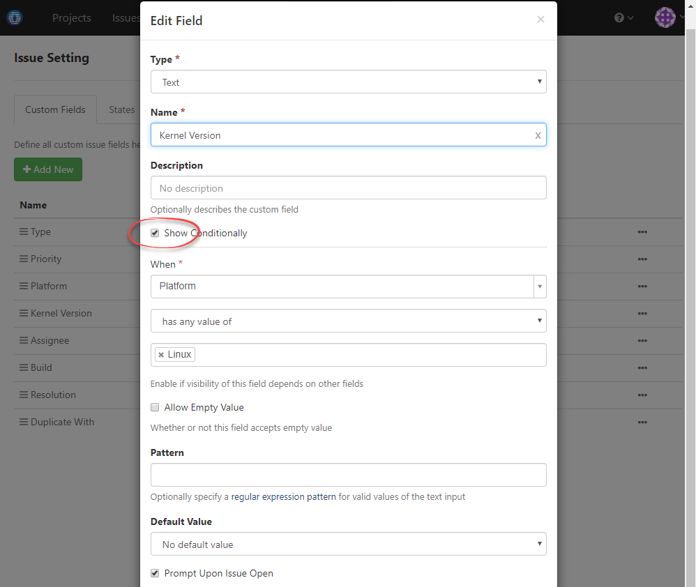

### Usage Scenario

Add custom field Platform and Kernel Version. Kernel Version should be displayed only when Platform is specified as Linux

### How to Set Up

1. Add custom field _Platform_ like below:

  
  
1. Add custom field _Kernel Version_ like below:

  