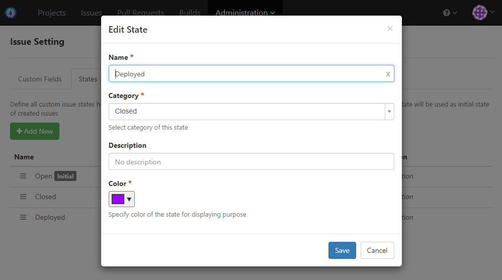
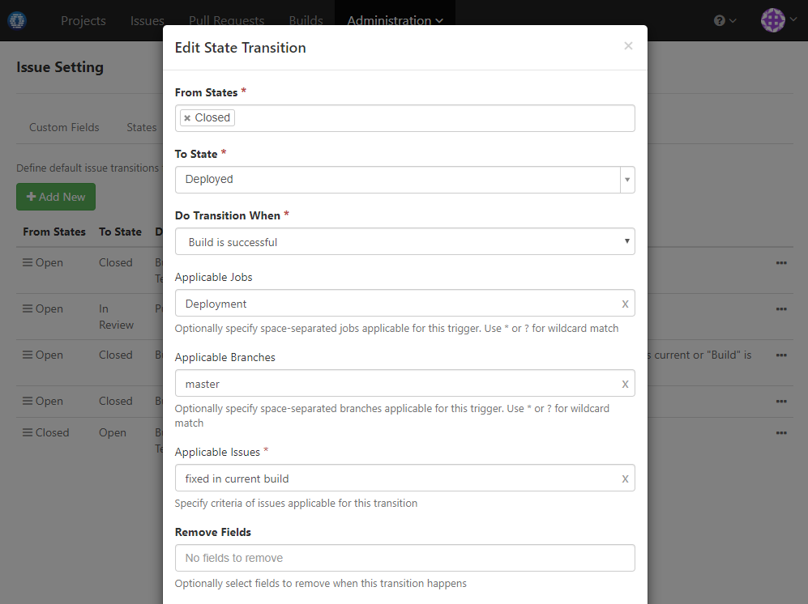

### Scenario

Auto-transit issue to custom state _Deployed_ when build fixing it is deployed

### How to Set Up

1. Add custom issue state _Deployed_ like below:

  
  
1. Add transition to move issues from _Closed_ to _Deployed_ like below:

  