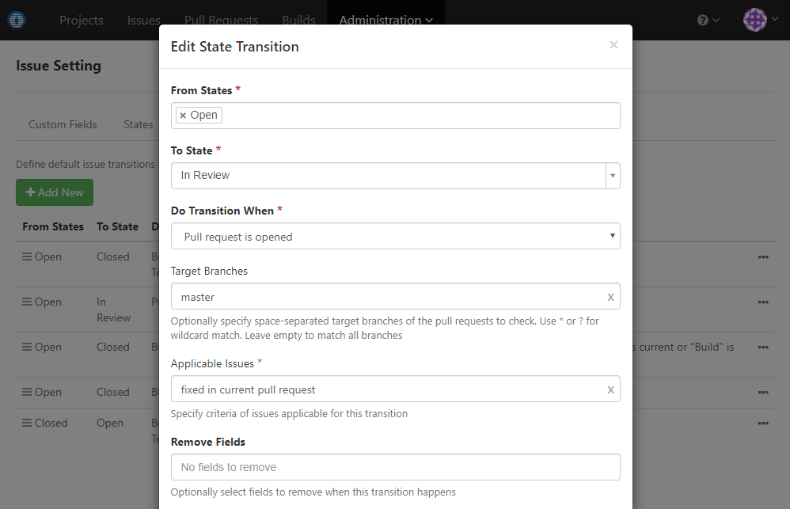

### Usage Scenario

Auto-transit issue to custom state _In Review_ when pull request fixing the issue is opened

### How to Set Up

1. Add issue custom state _In Review_ like below:

  

1. Add transition to move issue to _In Review_ state like below:

  