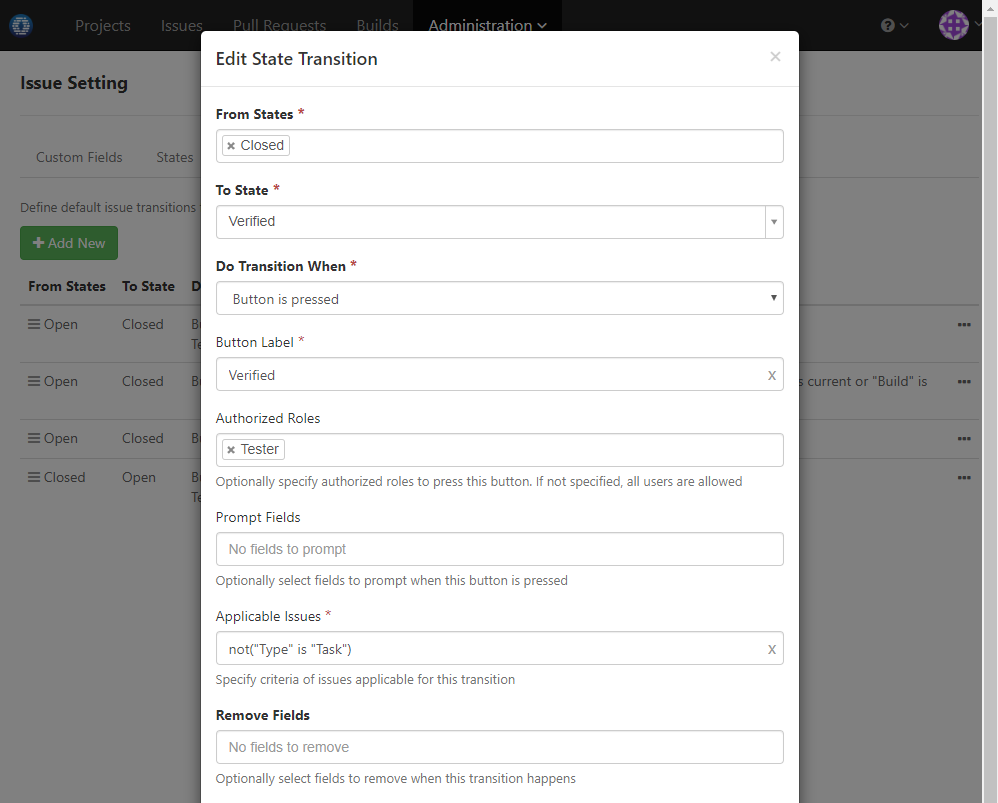

### Usage Scenario

Add custom state _Verified_. Only _Tester_ role can transit issues to this state. Further, the transition is applicable for all issue types except _Task_ 

### How to Set Up

1. Add custom issue state _Verified_ like below:

  
  
1. Add transition to move issue to _Verified_ state like below:

  