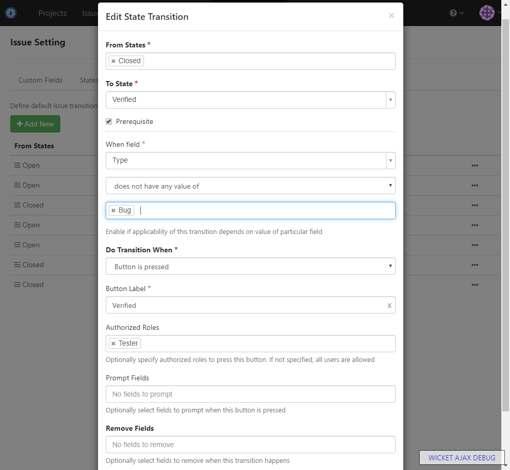

### Usage Scenario

Add custom state Verified. Only Tester role can transit issues to this state

### How to Set Up

1. Add custom issue state _Verified_ like below:

  
  
1. Add transition to move issue to _Verified_ state like below:

  