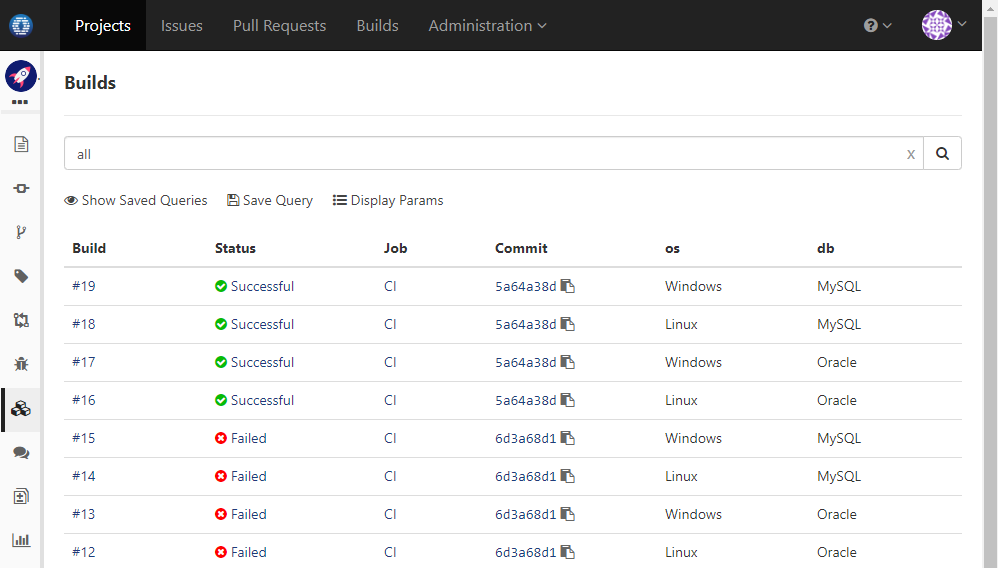

### Usage Scenario

Test against any combination of _Oracle/MySQL_ and _Linux/Windows_ upon master branch committing

### How to Set Up

To do it, edit build spec to add a CI job with below setting:

1. Define two parameters,  _db_ and  _os_:

 
 
1. Define a job trigger to trigger build whenever master branch is updated. The trigger specifies values _Oracle/MySQL_ for parameter _db_, and _Linux/Windows_ for parameter _os_:

  
  
1. In commands section of the job, uses parameter _db_ and _os_ via variable:

  
  
1. You may check the builds page to see build status of each parameter combination:

  