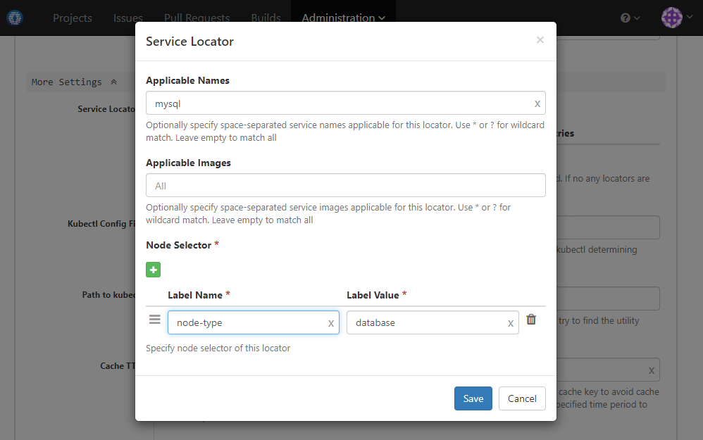

### Usage Scenario 

Use MySQL service while running job

### How to Set Up

1. Add a service in section _Dependencies & Services_  like below:

  
  
  Note that for MySQL root password, we are referencing secret _db-password_ defined in [this tutorial ](build-spec-secret.md)
  
1. If the job runs with a Kubernetes executor and if you want to run MySQL  service on particular nodes, configure service locator in section _More Settings_ of the executor like below:

  
  
1. Now in job commands you may connect to host name _mysql_ (same as service name) to do database related things