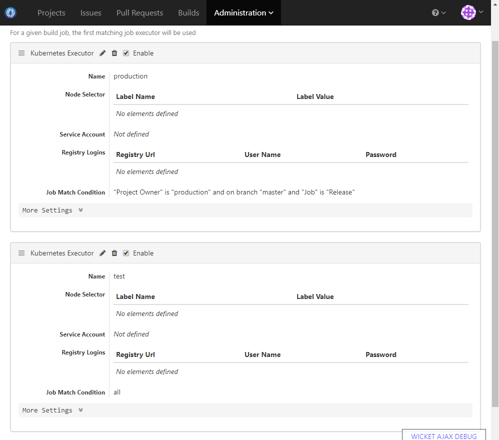

### Usage Scenario

Only release builds from master branch of certain projects can be deployed into production cluster, all other builds should use the test cluster

### How to Set Up

1. Make these projects owned by a certain user say _production_. 
2. Add job executors as below:

  
  
  When a release job from master branch of project owned by user _production_, the production cluster will be used to execute the job. Other jobs not matching this condition will fall back to use the test cluster