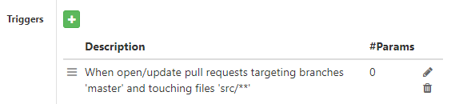
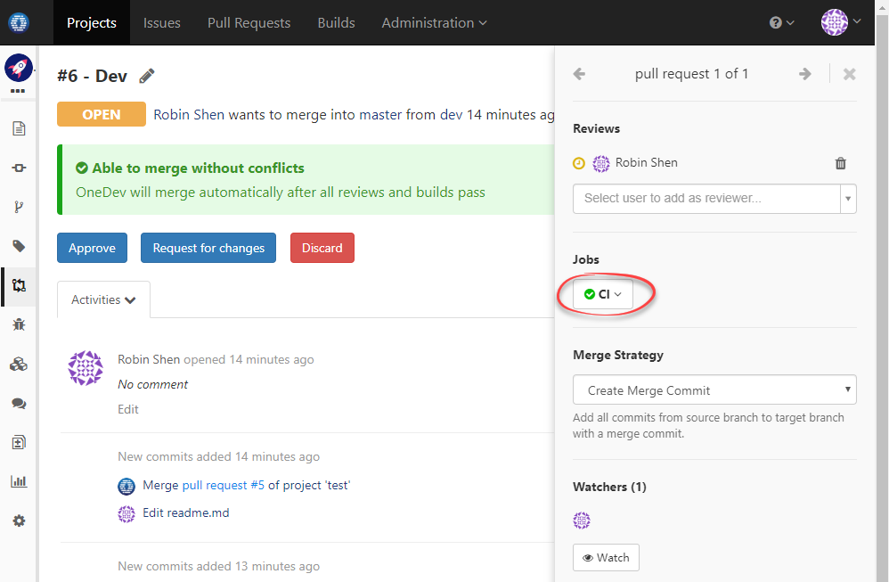
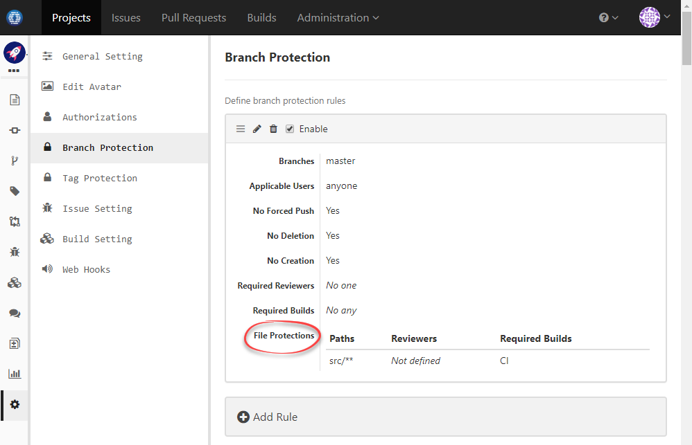

### Usage Scenario

Run CI job against merged commit of pull request only if the pull request changed files under src folder

### How to Set Up

1. Edit CI job definition to add a trigger upon build request open/update, with changed files matching _src/**_:

  
  
1. Now if a pull request contains commits changing files under _src_ directory, the CI build will be fired automatically:

  
  
1. However even if the CI build fails, the pull request can still merge as long as required reviewers approve. To enforce successful of CI build, we need to add a branch protection rule as below:

  