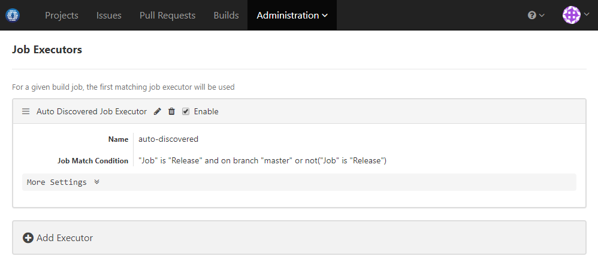

### Usage Scenario

Release builds can only be generated from master branch

### How to Set Up

Edit job executor to use job match condition as below:

This tells the executor to only accept release jobs from master branch, while accept non-release jobs from any branch.