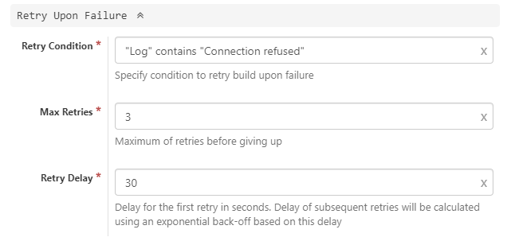

### Usage Scenario

Retry jobs upon Kubernetes worker node error

### How to Set Up

Expand section _Retry Upon Failure_ of the job and configure _Retry Condition_ to detect appropriate worker node error. For instance on Google Kubernetes Engine, if a node goes down the log will contain message _Connection refused_:

