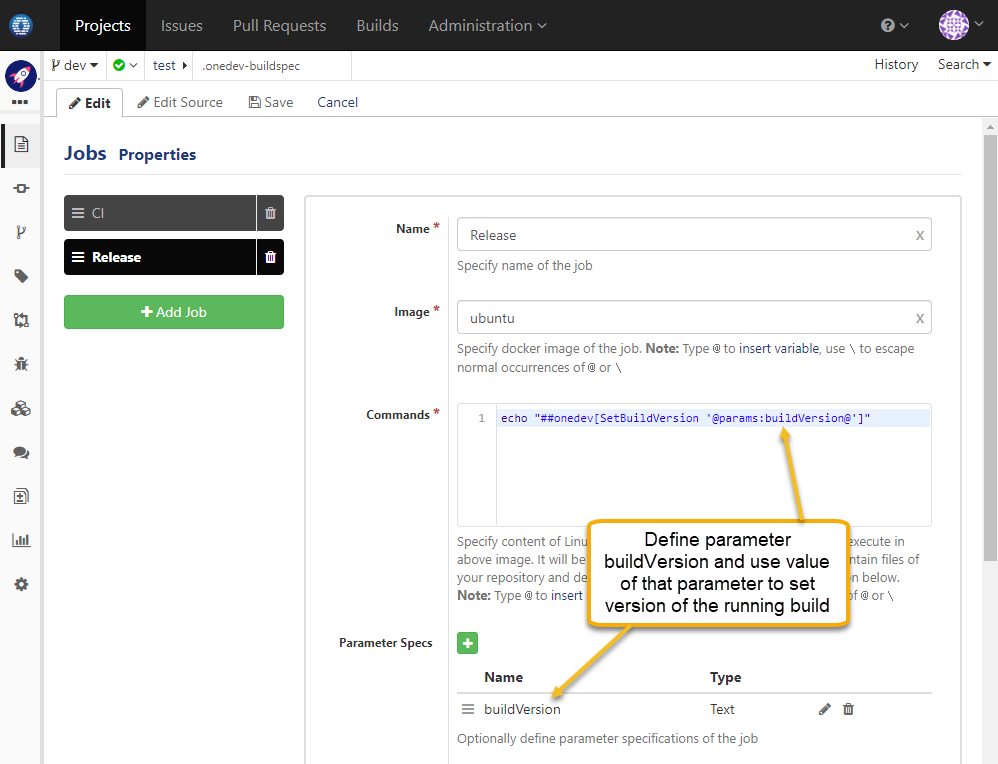

### Usage Scenario

Specify build version when manually trigger a build

### How to Set Up

To do this, define a job parameter say _buildVersion_ and use value of that parameter to set version of running build like below:

