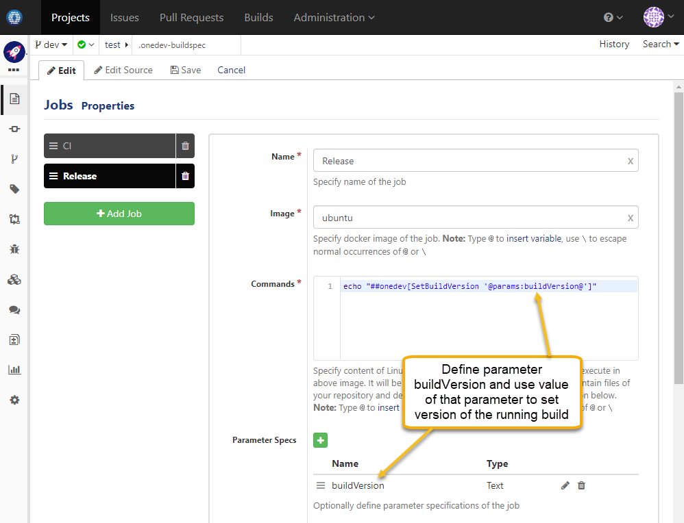
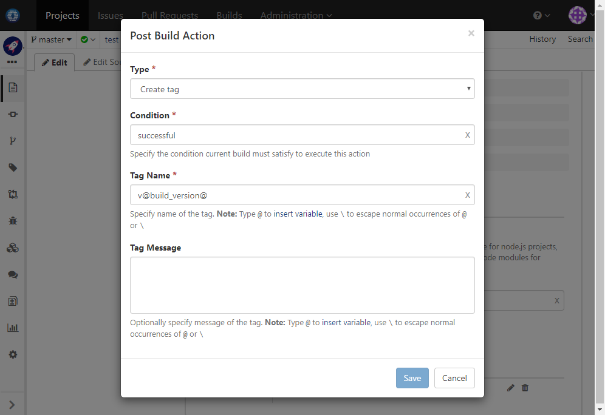

### Usage Scenario

Specify build version when manually trigger a build and create a corresponding tag if build is successful

### How to Set Up

1. Define a job parameter say _buildVersion_ and use value of that parameter to set version of running build like below:

  
  
1. Define a post-build action to create tag upon build success like below:

  
  
### Resources

Command to set build version:
```
echo "##onedev[SetBuildVersion '@params:buildVersion@']"
```