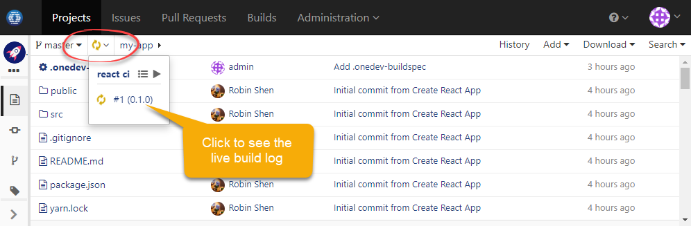

Try Build Farm In Kubernetes
---

1. Select desired [**OneDev release**](https://code.onedev.io/projects/onedev-server/builds?query=%22Job%22+is+%22Release%22)  and download _k8s-resources.zip_
2. Unzip the file, change into directory _production_, change node selectors, memory setting and disk setting if necessary, and  run command `kubectl apply -k .` OneDev resources will be created under namespace _onedev_
 
 **NOTE:**

  * Besides creating resources in namespace _onedev_, a cluster role _onedev_ and associated cluster role binding _onedev_ will be created in 
default namespace. This is necessary as OneDev needs to be granted some cluster-wide permissions to run builds as pods. For details, please 
check file _base/cluster-roles.yaml_
  * OneDev will create two persistent volume claims, one to store MySQL database files, and another to store OneDev data including repositories. The actual place of these volumes varies depending on your Kubernetes cluster config. On Google Kubernetes Engine, they will be created as Google persistent disks

4. Wait a while for pods in namespace _onedev_ to be up and running. Run below command to get external ip address of onedev service:

  ```
  kubectl get service onedev -n onedev
  ```
  
 
1. Point your browser to `http://<onedev-external-ip>` to set up OneDev. In system setting page, just use suggested server url

1. From OneDev projects page, add a project _my-app_

1. Run below command from your local machine to create a react application:

  ```
  npx create-react-app my-app
  ```
  
1. Change into directory _my-app_, and run below command to push code to OneDev:

  ```
  git remote add origin http://<onedev-external-ip>/projects/my-app
  git push origin master:master
  ```
  When prompted, input administrator account specified above as git credential
  
1. Visit files page of project _my-app_ from OneDev, click link _add build spec_ to bring up the GUI to add build specification. For typical projects, OneDev suggests default job templates like below:

  
  
1. Just use the default template, and save the spec. Now you will see that a CI build is running as pods in your cluster. 

  
    
1. Congrats! You've finished the tutorial. Continue to check [**typical usage scenarios**](usage-scenarios.md) if you are interested.