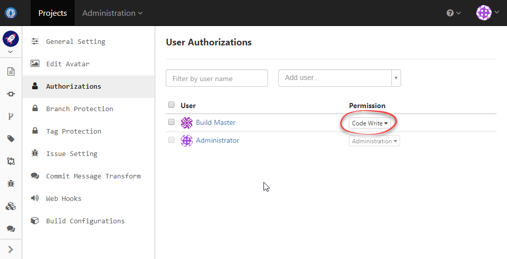

# QuickBuild Set Up (tested on 7.0)
-----------------

Assume we have a project named _test_ at OneDev side. The clone url is http://matrix:6610/projects/test.

  

### Set up QuickBuild to report build status

1. At OneDev side, add an user to be used by QuickBuild to access the _test_ project. This user should have write permission over the project.
   
    
  
1.  At QuickBuild side, create a configuration say _root/test_, and add a **GitHub** repository (OneDev mimics GitHub Restful API to work with other systems) like below:
     
     
     
1. At QuickBuild side, add steps to checkout and build against the repository in configuration _root/test_:

    
    
1. At QuickBuild side, run configuration _root/test_. After build finishes, check commits page at OneDev side and we will see that corresponding commits are marked with build status.

    
    
### Set up QuickBuild to verify pull requests

1. Make sure QuickBuild has been [set up to report build status](#set-up-quickbuild-to-report-build-status) to OneDev.

1. At QuickBuild side, edit the repository to enable pull request.
   
    
      
1. At QuickBuild side, schedule the configuration to build automatically whenever there are new changes in the project.  
   
3. At OneDev side, add a branch protection rule to require QuickBuild verification.

    
    
    For brevity, we do not specify any mandatory reviewers here. The pull request will be merged automatically (unless the merge strategy is specified as "Do Not Merge") after build succeeds.
    
4. Now let's create a pull request to test the setup.

    

    We will see that the pull request is waiting for QuickBuild to build it. After QuickBuild builds successfully, the pull request will be merged automatically. 
    
    