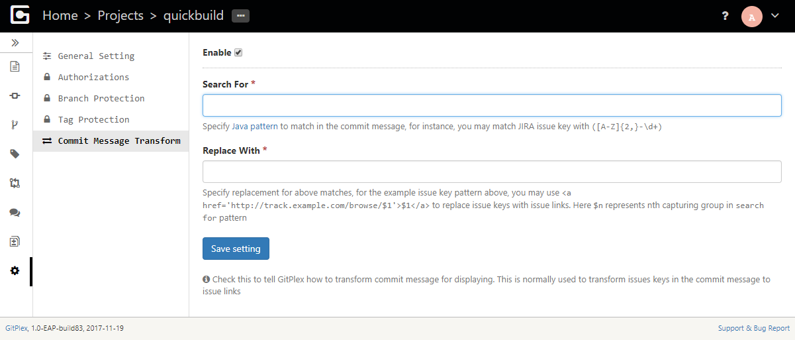

# Transform Commit Message
-------------------

The commit message transform setting allows you to search for specified pattern in commit messages and convert them to another form. This is often used to convert issue keys in commit message to issue links:

